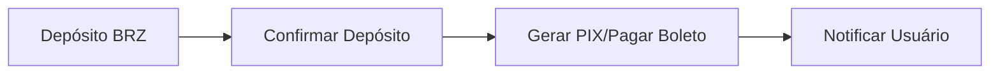
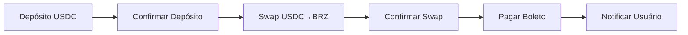
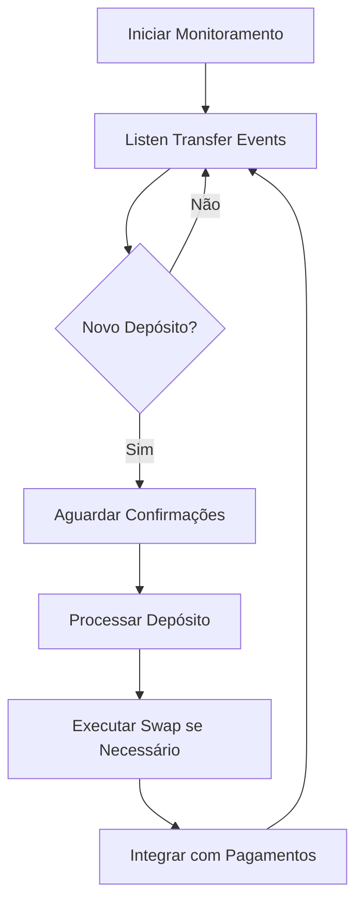

# 🔗 Integração Blockchain - Capy Pay Backend

Documentação completa dos serviços blockchain para monitoramento de depósitos e execução de swaps na rede Base.

## 🏗️ Arquitetura dos Serviços Blockchain

### Stack Tecnológico
- **ethers.js v6** - Interação com blockchain Ethereum/Base
- **1inch API v6** - Agregador DEX para swaps otimizados
- **Node Providers** - Alchemy, Infura, QuickNode para redundância
- **Event Listeners** - Monitoramento em tempo real de eventos Transfer
- **BigNumber.js** - Cálculos precisos com tokens

### Estrutura dos Serviços
```
backend/src/services/
├── BlockchainMonitorService.js    # Monitoramento de depósitos
├── SwapService.js                 # Execução de swaps via 1inch
├── IntegrationService.js          # Orquestração de fluxos completos
└── StarkBankService.js           # Integração com pagamentos fiat
```

## 🔍 BlockchainMonitorService

### Funcionalidades Principais

#### 1. **Conexão Multi-Provider**
```javascript
// Providers configurados em ordem de prioridade
const providers = [
  new ethers.AlchemyProvider('base', ALCHEMY_API_KEY),
  new ethers.InfuraProvider('base', INFURA_API_KEY),
  new ethers.JsonRpcProvider(QUICKNODE_URL),
  new ethers.JsonRpcProvider(BASE_RPC_URL) // Fallback
];
```

#### 2. **Monitoramento de Tokens**
- **USDC**: `0x833589fCD6eDb6E08f4c7C32D4f71b54bdA02913`
- **BRZ**: `0x420000000000000000000000000000000000000A`
- **EURC**: `0x60a3E35Cc302bFA44Cb288Bc5a4F316Fdb1adb42`

#### 3. **Event Listeners**
```javascript
// Listener para eventos Transfer
const filter = contract.filters.Transfer(
  null, // qualquer remetente
  DEPOSIT_WALLET_ADDRESS // para nossa wallet
);

contract.on(filter, async (from, to, amount, event) => {
  await handleDepositEvent(symbol, tokenInfo, {
    from, to, amount, event
  });
});
```

### Métodos Principais

#### `startMonitoring()`
Inicia monitoramento de depósitos para todos os tokens configurados.

#### `getTokenBalance(tokenSymbol, walletAddress)`
```javascript
const balance = await monitor.getTokenBalance('USDC');
// Retorna: { symbol: 'USDC', balance: '1000.50', balanceWei: '1000500000' }
```

#### `getAllBalances(walletAddress)`
Obtém saldos de todos os tokens suportados.

#### `getDepositHistory(limit)`
Lista histórico de depósitos confirmados.

## 💱 SwapService

### Integração 1inch API v6

#### Configuração
```javascript
const config = {
  baseUrl: 'https://api.1inch.dev/swap/v6.0/8453', // Base network
  chainId: 8453,
  slippage: 1, // 1% padrão
  apiKey: process.env.ONEINCH_API_KEY
};
```

#### Fluxo de Swap
1. **Verificação de Saldo**
2. **Obtenção de Cotação** via 1inch API
3. **Aprovação de Allowance** (se necessário)
4. **Execução da Transação**
5. **Confirmação na Blockchain**

### Métodos Principais

#### `executeSwap(fromToken, toToken, amount, privateKey, metadata)`
```javascript
const result = await swapService.executeSwap(
  'USDC', 'BRZ', '100', privateKey, 
  { purpose: 'payment_conversion' }
);

// Retorna:
{
  success: true,
  txHash: '0x...',
  fromAmount: '100',
  toAmount: '550.25',
  gasUsed: '180000'
}
```

#### `getBestRoute(fromToken, toToken, amount)`
Obtém melhor rota e cotação sem executar o swap.

#### `calculatePriceImpact(fromToken, toToken, amount)`
Calcula impacto de preço para grandes volumes.

#### `isSwapViable(fromToken, toToken, amount, maxPriceImpact)`
Verifica se o swap é economicamente viável.

## 🔄 IntegrationService

### Orquestração de Fluxos Completos

#### Fluxo: Depósito → Swap → Pagamento
```javascript
const result = await integrationService.processPaymentFlow({
  depositAmount: '100',
  depositToken: 'USDC',
  targetCurrency: 'BRL',
  paymentType: 'boleto',
  paymentDetails: '34191790010104351004791020150008291070026000',
  userId: 'user_123'
});
```

### Lógica de Conversão
```javascript
// Regras de swap automático
const swapRules = {
  'BRL': ['BRZ'], // Para BRL, aceita BRZ diretamente
  'USD': ['USDC'], // Para USD, aceita USDC diretamente  
  'EUR': ['EURC'], // Para EUR, aceita EURC diretamente
};
```

## 📡 API Endpoints Blockchain

### Base URL: `/api/blockchain`

#### 1. **Status dos Serviços**
```http
GET /api/blockchain/status
X-API-Key: your_api_key
```

**Resposta:**
```json
{
  "success": true,
  "data": {
    "monitor": {
      "isMonitoring": true,
      "currentBlock": 8450123,
      "balances": { "USDC": "1000.50", "BRZ": "5500.25" }
    },
    "swap": {
      "apiStatus": "operational",
      "supportedTokens": ["USDC", "BRZ", "EURC"]
    }
  }
}
```

#### 2. **Iniciar Monitoramento**
```http
POST /api/blockchain/monitor/start
X-API-Key: your_api_key
```

#### 3. **Obter Saldos**
```http
GET /api/blockchain/balances?address=0x...
X-API-Key: your_api_key
```

#### 4. **Cotação de Swap**
```http
POST /api/blockchain/swap/quote
Content-Type: application/json
X-API-Key: your_api_key

{
  "fromToken": "USDC",
  "toToken": "BRZ", 
  "amount": 100
}
```

**Resposta:**
```json
{
  "success": true,
  "data": {
    "fromToken": "USDC",
    "toToken": "BRZ",
    "fromAmount": "100",
    "toAmount": "550.25",
    "gasEstimate": "180000"
  }
}
```

#### 5. **Executar Swap**
```http
POST /api/blockchain/swap/execute
Content-Type: application/json
X-API-Key: your_api_key

{
  "fromToken": "USDC",
  "toToken": "BRZ",
  "amount": 100,
  "privateKey": "0x...",
  "maxPriceImpact": 2
}
```

#### 6. **Histórico de Depósitos**
```http
GET /api/blockchain/deposits?limit=50
X-API-Key: your_api_key
```

#### 7. **Histórico de Swaps**
```http
GET /api/blockchain/swaps?limit=50
X-API-Key: your_api_key
```

## 🔧 Configuração de Ambiente

### Variáveis Essenciais

```env
# Base Network
BASE_RPC_URL=https://mainnet.base.org
BASE_PRIVATE_KEY=0x...
BASE_WALLET_ADDRESS=0x...

# Node Providers (redundância)
ALCHEMY_API_KEY=your_alchemy_key
INFURA_API_KEY=your_infura_key
QUICKNODE_URL=https://your-endpoint.quiknode.pro/...

# 1inch API
ONEINCH_API_KEY=your_1inch_api_key
ONEINCH_BASE_URL=https://api.1inch.dev/swap/v6.0/8453

# Contratos de Tokens
USDC_BASE_CONTRACT=0x833589fCD6eDb6E08f4c7C32D4f71b54bdA02913
BRZ_BASE_CONTRACT=0x420000000000000000000000000000000000000A
EURC_BASE_CONTRACT=0x60a3E35Cc302bFA44Cb288Bc5a4F316Fdb1adb42

# Monitoramento
DEPOSIT_WALLET_ADDRESS=0x...
BLOCK_CONFIRMATION_COUNT=3
MONITORING_INTERVAL_MS=5000
```

### Configuração de Credenciais

#### 1. **Obter API Key da 1inch**
1. Acesse [1inch Developer Portal](https://portal.1inch.dev/)
2. Crie uma conta
3. Gere API Key
4. Configure rate limits

#### 2. **Configurar Node Providers**

**Alchemy:**
1. Acesse [Alchemy Dashboard](https://dashboard.alchemy.com/)
2. Crie app para Base network
3. Copie API Key

**Infura:**
1. Acesse [Infura Dashboard](https://infura.io/dashboard)
2. Crie projeto Base
3. Copie Project ID

**QuickNode:**
1. Acesse [QuickNode](https://www.quicknode.com/)
2. Crie endpoint Base
3. Copie URL completa

#### 3. **Configurar Wallet**
```bash
# Gerar nova wallet (desenvolvimento)
node -e "
const { ethers } = require('ethers');
const wallet = ethers.Wallet.createRandom();
console.log('Private Key:', wallet.privateKey);
console.log('Address:', wallet.address);
"
```

## 🔍 Monitoramento e Logs

### Eventos Importantes

#### Depósito Detectado
```json
{
  "level": "info",
  "message": "Deposit detected and confirmed",
  "symbol": "USDC",
  "from": "0x...",
  "amount": "100.50",
  "txHash": "0x...",
  "blockNumber": 8450123
}
```

#### Swap Executado
```json
{
  "level": "info", 
  "message": "Swap completed successfully",
  "fromToken": "USDC",
  "toToken": "BRZ",
  "fromAmount": "100",
  "toAmount": "550.25",
  "txHash": "0x...",
  "gasUsed": "180000"
}
```

### Métricas de Monitoramento
- **Depósitos por hora**
- **Volume de swaps**
- **Taxa de sucesso de transações**
- **Tempo médio de confirmação**
- **Saldos de tokens**

## 🧪 Testes e Desenvolvimento

### Ambiente de Desenvolvimento
```bash
# Iniciar servidor com logs detalhados
LOG_LEVEL=debug npm run dev

# Testar conectividade blockchain
curl -X GET "http://localhost:3001/api/blockchain/status" \
  -H "X-API-Key: your_api_key"

# Testar cotação de swap
curl -X POST "http://localhost:3001/api/blockchain/swap/quote" \
  -H "Content-Type: application/json" \
  -H "X-API-Key: your_api_key" \
  -d '{"fromToken":"USDC","toToken":"BRZ","amount":10}'
```

### Testes de Integração
```javascript
// Teste completo de fluxo
const integrationService = new IntegrationService();
await integrationService.initialize();

const result = await integrationService.processPaymentFlow({
  depositAmount: '10',
  depositToken: 'USDC',
  targetCurrency: 'BRL',
  paymentType: 'pix',
  userId: 'test_user'
});
```

## 🚨 Tratamento de Erros

### Erros Comuns

#### "Provider connection failed"
```bash
# Verificar conectividade
curl -X POST "https://mainnet.base.org" \
  -H "Content-Type: application/json" \
  -d '{"jsonrpc":"2.0","method":"eth_blockNumber","params":[],"id":1}'
```

#### "Insufficient allowance"
- Verificar aprovação de tokens
- Executar approve() se necessário

#### "1inch API error"
- Verificar API key
- Verificar rate limits
- Verificar liquidez do par

#### "Transaction failed"
- Verificar gas price
- Verificar saldo
- Verificar slippage

## 🔐 Segurança

### Boas Práticas Implementadas
- **Private keys** nunca em logs
- **Rate limiting** em APIs
- **Input validation** rigorosa
- **Multi-provider** redundância
- **Confirmation counts** configuráveis

### Monitoramento de Segurança
- Logs de transações suspeitas
- Alertas de saldo baixo
- Monitoramento de gas price
- Verificação de slippage

## 📈 Otimizações

### Performance
- **Connection pooling** para providers
- **Cache** de cotações (1 minuto)
- **Batch requests** quando possível
- **Async processing** de eventos

### Economia de Gas
- **Gas price** otimização dinâmica
- **Approval** máxima para evitar re-aprovações
- **Batch transactions** quando viável

---

## 🔄 Fluxos de Integração

### Fluxo 1: Depósito → Pagamento Direto


### Fluxo 2: Depósito → Swap → Pagamento


### Fluxo 3: Monitoramento Contínuo


---

**🔗 A integração blockchain do Capy Pay está completa e pronta para produção!** 