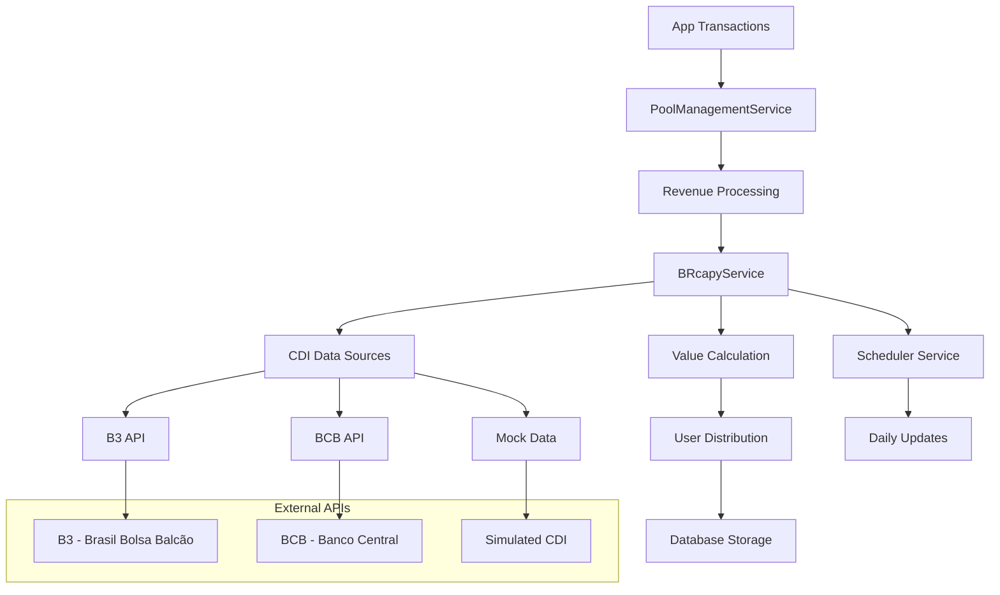
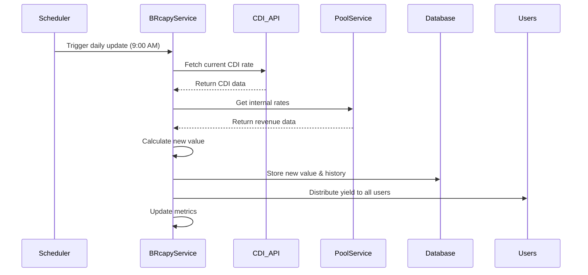
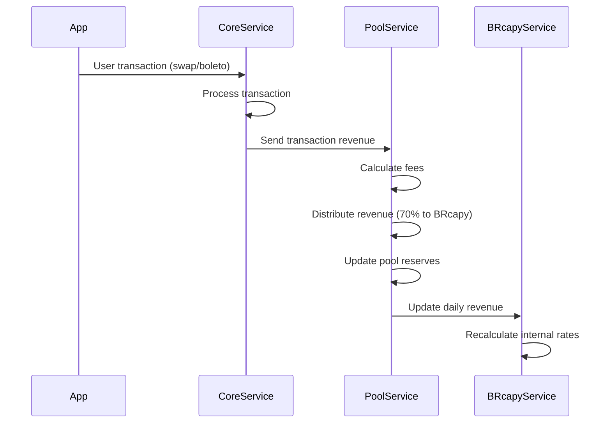
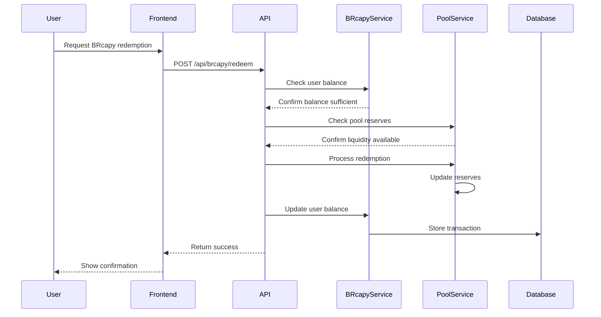

# 🐹 BRcapy - Yieldcoin Técnica Especificação

## Visão Geral

A **BRcapy** é a yieldcoin nativa do Capy Pay, uma stablecoin com rendimento que combina a estabilidade do mercado tradicional brasileiro (CDI) com os rendimentos gerados pelo uso da plataforma. É uma inovação financeira que oferece rendimento real aos usuários enquanto mantém liquidez e transparência total.

## 🧮 Modelo Matemático

### Fórmula de Valorização Principal

```javascript
Valor_BRcapy_Novo = Valor_BRcapy_Anterior × (1 + CDI_Diário + Taxas_Internas_Diárias)

Onde:
- CDI_Diário = (Taxa_CDI_Anual / 365) / 100
- Taxas_Internas_Diárias = (Revenue_Diário / Pool_Total) × Fator_Distribuição
- Fator_Distribuição = 0.7 (70% do revenue vai para BRcapy holders)
```

### Componentes do Rendimento

#### 1. CDI (Certificado de Depósito Interbancário)
```javascript
// Taxa CDI atual (exemplo: 13.75% a.a.)
const taxaCDIAnual = 13.75; // %

// Conversão para taxa diária
const taxaCDIDiaria = (taxaCDIAnual / 365) / 100;
// Resultado: 0.000377 (0.0377% ao dia)
```

#### 2. Taxas Internas do App
```javascript
// Revenue diário gerado pelo app
const revenueTransacoes = {
  crypto_swap: valor_transacao * 0.005,      // 0.5%
  boleto_payment: valor_transacao * 0.015,   // 1.5%
  pix_transfer: valor_transacao * 0.001,     // 0.1%
  international_transfer: valor_transacao * 0.025, // 2.5%
  card_transaction: valor_transacao * 0.02   // 2.0%
};

// Distribuição do revenue
const distribuicao = {
  para_brcapy: revenue_total * 0.7,    // 70%
  para_reserva: revenue_total * 0.2,   // 20%
  para_operacao: revenue_total * 0.1   // 10%
};

// Taxa interna diária
const taxaInternaDiaria = distribuicao.para_brcapy / pool_total;
```

### Limitadores de Segurança

```javascript
const limitadores = {
  yield_minimo_diario: 0.0001,  // 0.01% ao dia (proteção contra CDI negativo)
  yield_maximo_diario: 0.005,   // 0.5% ao dia (proteção contra volatilidade)
  
  // Aplicação dos limitadores
  yield_final: Math.max(
    limitadores.yield_minimo_diario,
    Math.min(yield_calculado, limitadores.yield_maximo_diario)
  )
};
```

## 🏗️ Arquitetura do Sistema

### Componentes Principais



### 1. BRcapyService - Núcleo da Yieldcoin

#### Responsabilidades
- Buscar taxa CDI de fontes confiáveis
- Calcular taxas internas baseadas no revenue do app
- Aplicar fórmula de valorização diária
- Distribuir rendimentos para usuários
- Manter histórico de valorização
- Gerenciar métricas de performance

#### Configuração Principal
```javascript
const config = {
  initialValue: new BigNumber('1.00'),           // Valor inicial da BRcapy
  internalTaxDistributionFactor: 0.7,            // 70% do revenue
  minimumDailyYield: 0.0001,                     // 0.01% mínimo
  maximumDailyYield: 0.005,                      // 0.5% máximo
  updateTime: '09:00',                           // Horário de atualização
  decimalPlaces: 8                               // Precisão decimal
};
```

#### Fontes de Dados CDI
```javascript
const cdiSources = {
  primary: {
    name: 'B3_API',
    url: 'https://api.b3.com.br/api/v1/indices/CDI',
    reliability: 99.9,
    updateFrequency: 'real-time'
  },
  
  fallback: {
    name: 'BCB_API', 
    url: 'https://api.bcb.gov.br/dados/serie/bcdata.sgs.11/dados/ultimos/1',
    reliability: 99.5,
    updateFrequency: 'daily'
  },
  
  mock: {
    name: 'SIMULATED',
    baseRate: 13.75,
    volatility: 0.1,
    useCase: 'development'
  }
};
```

### 2. PoolManagementService - Gestão de Lastro

#### Pool de Reservas
```javascript
const poolAssets = {
  reserves: {
    USDC: new BigNumber('500000'),  // $500k USDC
    USDT: new BigNumber('300000'),  // $300k USDT  
    BUSD: new BigNumber('200000'),  // $200k BUSD
    BRL: new BigNumber('520000')    // R$ 520k BRL
  },
  
  weights: {
    USDC: 1.0,    // Peso total
    USDT: 0.98,   // 2% desconto por risco
    BUSD: 0.97,   // 3% desconto por risco
    BRL: 1.0      // Peso total
  }
};
```

#### Métricas de Saúde da Pool
```javascript
const healthMetrics = {
  reserveRatio: {
    minimum: 0.2,    // 20% mínimo
    target: 0.5,     // 50% ideal
    current: 0.45    // 45% atual
  },
  
  utilizationRate: {
    maximum: 0.8,    // 80% máximo
    current: 0.35    // 35% atual
  },
  
  diversification: {
    minimumAssets: 2,
    currentAssets: 4
  }
};
```

### 3. Scheduler Service - Atualizações Automáticas

#### Cronograma de Operações
```javascript
const scheduledTasks = {
  // Atualização diária do valor da BRcapy
  dailyValueUpdate: {
    schedule: '0 9 * * *',        // 9h da manhã
    timezone: 'America/Sao_Paulo',
    function: 'updateBRcapyValue()',
    critical: true
  },
  
  // Atualização de dados da pool
  poolDataUpdate: {
    schedule: '0 * * * *',        // A cada hora
    function: 'updatePoolData()',
    critical: false
  },
  
  // Verificação de saúde do sistema
  healthCheck: {
    schedule: '*/15 * * * *',     // A cada 15 minutos
    function: 'checkSystemHealth()',
    critical: true
  }
};
```

## 💾 Estrutura de Dados

### Banco de Dados - Schema Principal

```sql
-- Dados globais da BRcapy
CREATE TABLE brcapy_global (
    id UUID PRIMARY KEY DEFAULT gen_random_uuid(),
    current_value DECIMAL(18,8) NOT NULL,
    total_supply DECIMAL(18,8) NOT NULL DEFAULT 0,
    last_update TIMESTAMP NOT NULL DEFAULT NOW(),
    cdi_rate DECIMAL(8,4),
    internal_rate DECIMAL(8,4),
    total_yield DECIMAL(8,4),
    pool_value DECIMAL(18,2),
    created_at TIMESTAMP DEFAULT NOW()
);

-- Histórico diário de valorização
CREATE TABLE brcapy_daily_history (
    id UUID PRIMARY KEY DEFAULT gen_random_uuid(),
    date DATE NOT NULL UNIQUE,
    brcapy_value DECIMAL(18,8) NOT NULL,
    cdi_rate DECIMAL(8,4) NOT NULL,
    internal_rate DECIMAL(8,4) NOT NULL,
    total_yield DECIMAL(8,4) NOT NULL,
    pool_value DECIMAL(18,2) NOT NULL,
    daily_revenue DECIMAL(18,2) NOT NULL,
    transactions_count INTEGER DEFAULT 0,
    created_at TIMESTAMP DEFAULT NOW()
);

-- Balanços de usuários
CREATE TABLE brcapy_user_balances (
    id UUID PRIMARY KEY DEFAULT gen_random_uuid(),
    user_id VARCHAR(255) NOT NULL,
    balance DECIMAL(18,8) NOT NULL DEFAULT 0,
    last_update TIMESTAMP NOT NULL DEFAULT NOW(),
    created_at TIMESTAMP DEFAULT NOW(),
    UNIQUE(user_id)
);

-- Histórico de transações de usuários
CREATE TABLE brcapy_user_transactions (
    id UUID PRIMARY KEY DEFAULT gen_random_uuid(),
    user_id VARCHAR(255) NOT NULL,
    transaction_type VARCHAR(50) NOT NULL, -- 'distribution', 'redemption', 'daily_yield'
    amount DECIMAL(18,8) NOT NULL,
    balance_before DECIMAL(18,8) NOT NULL,
    balance_after DECIMAL(18,8) NOT NULL,
    brcapy_price DECIMAL(18,8) NOT NULL,
    reason VARCHAR(255),
    metadata JSONB,
    created_at TIMESTAMP DEFAULT NOW()
);

-- Pool de reservas
CREATE TABLE pool_reserves (
    id UUID PRIMARY KEY DEFAULT gen_random_uuid(),
    asset VARCHAR(10) NOT NULL,
    amount DECIMAL(18,8) NOT NULL,
    weight DECIMAL(4,3) NOT NULL DEFAULT 1.000,
    last_update TIMESTAMP NOT NULL DEFAULT NOW(),
    UNIQUE(asset)
);

-- Transações da pool
CREATE TABLE pool_transactions (
    id UUID PRIMARY KEY DEFAULT gen_random_uuid(),
    transaction_type VARCHAR(50) NOT NULL,
    asset VARCHAR(10) NOT NULL,
    amount DECIMAL(18,8) NOT NULL,
    reason VARCHAR(255),
    metadata JSONB,
    created_at TIMESTAMP DEFAULT NOW()
);

-- Índices para performance
CREATE INDEX idx_brcapy_daily_history_date ON brcapy_daily_history(date DESC);
CREATE INDEX idx_brcapy_user_balances_user_id ON brcapy_user_balances(user_id);
CREATE INDEX idx_brcapy_user_transactions_user_id ON brcapy_user_transactions(user_id, created_at DESC);
CREATE INDEX idx_pool_transactions_created_at ON pool_transactions(created_at DESC);
```

### Estrutura de Dados em Memória (MVP)

```javascript
// Dados globais da BRcapy
const brcapyData = {
  currentValue: new BigNumber('1.05234567'),
  lastUpdate: '2024-01-15T09:00:00.000Z',
  dailyHistory: [
    {
      date: '2024-01-15',
      value: '1.05234567',
      cdi_rate: '13.75',
      internal_rate: '0.0234',
      total_yield: '0.0411',
      pool_value: '1520000.00',
      daily_revenue: '2340.50'
    }
  ],
  totalSupply: new BigNumber('1000000'),
  totalPoolValue: new BigNumber('1520000')
};

// Balanços de usuários
const userBalances = new Map([
  ['user_123', {
    balance: new BigNumber('1000.50000000'),
    lastUpdate: '2024-01-15T09:00:00.000Z',
    history: [
      {
        date: '2024-01-15',
        type: 'daily_yield',
        amount: '0.41100000',
        balance_after: '1000.50000000',
        yield_rate: '0.0411%'
      }
    ]
  }]
]);

// Estado da pool
const poolState = {
  reserves: {
    'USDC': new BigNumber('500000'),
    'USDT': new BigNumber('300000'),
    'BUSD': new BigNumber('200000'),
    'BRL': new BigNumber('520000')
  },
  totalValueBRL: new BigNumber('1520000'),
  totalRevenue: new BigNumber('45000'),
  dailyRevenue: new BigNumber('2340.50'),
  utilizationRate: 0.35,
  reserveRatio: 0.45,
  status: 'healthy'
};
```

## 🔄 Fluxos de Operação

### Fluxo de Atualização Diária



### Fluxo de Processamento de Revenue



### Fluxo de Resgate de BRcapy



## 📊 Métricas e KPIs

### Métricas de Performance da BRcapy

```javascript
const brcapyMetrics = {
  // Rendimento
  apy: 15.2,                    // Annual Percentage Yield
  averageDailyYield: 0.0411,    // Rendimento médio diário
  cumulativeYield: 5.23,        // Rendimento acumulado desde início
  
  // Adoção
  totalUsers: 15420,            // Total de holders
  activeUsers: 8934,            // Usuários com saldo > 0
  newUsersThisMonth: 2341,      // Novos usuários no mês
  
  // Volume
  totalSupply: 1000000,         // Supply total em circulação
  averageHolding: 64.84,        // Holding médio por usuário
  totalValueLocked: 1052345.67, // Valor total em BRL
  
  // Pool
  poolUtilization: 35,          // Taxa de utilização da pool
  reserveRatio: 45,             // Razão de reserva
  diversificationIndex: 0.85    // Índice de diversificação
};
```

### Métricas de Revenue e Pool

```javascript
const poolMetrics = {
  // Revenue
  dailyRevenue: 2340.50,        // Revenue diário em BRL
  monthlyRevenue: 67834.20,     // Revenue mensal
  revenueGrowthRate: 12.3,      // Taxa de crescimento mensal
  
  // Composição do Revenue por Fonte
  revenueBySource: {
    crypto_swap: 45,            // 45% do revenue
    boleto_payment: 35,         // 35% do revenue  
    international_transfer: 12,  // 12% do revenue
    other: 8                    // 8% outros
  },
  
  // Pool Health
  totalLiquidity: 1520000,      // Liquidez total
  utilizationRate: 35,          // Taxa de utilização
  healthScore: 92               // Score de saúde (0-100)
};
```

## 🔌 Integração com APIs Externas

### Integração com B3 (Brasil, Bolsa, Balcão)

```javascript
const b3Integration = {
  endpoint: 'https://api.b3.com.br/api/v1/indices/CDI',
  authentication: 'Bearer Token',
  
  // Exemplo de resposta
  responseFormat: {
    "indice": "CDI",
    "taxa": 13.75,
    "data": "2024-01-15",
    "fonte": "B3",
    "atualizacao": "2024-01-15T16:30:00Z"
  },
  
  // Tratamento de erro
  errorHandling: {
    timeout: 10000,
    retries: 3,
    fallbackToBCB: true
  }
};
```

### Integração com Banco Central (BCB)

```javascript
const bcbIntegration = {
  endpoint: 'https://api.bcb.gov.br/dados/serie/bcdata.sgs.11/dados/ultimos/1?formato=json',
  authentication: 'Public API',
  
  // Exemplo de resposta
  responseFormat: [
    {
      "data": "15/01/2024",
      "valor": "13.75"
    }
  ],
  
  // Processamento
  processing: {
    parseDate: (dateStr) => new Date(dateStr.split('/').reverse().join('-')),
    parseRate: (valor) => parseFloat(valor),
    validation: (rate) => rate > 0 && rate < 50
  }
};
```

## 🔒 Segurança e Auditoria

### Controles de Segurança

```javascript
const securityControls = {
  // Validação de entrada
  inputValidation: {
    amountLimits: {
      minimum: 0.00000001,
      maximum: 1000000
    },
    rateValidation: {
      cdiMinimum: 0,
      cdiMaximum: 50,
      internalRateMaximum: 5
    }
  },
  
  // Limitadores de risco
  riskLimiters: {
    dailyYieldCap: 0.5,          // Máximo 0.5% ao dia
    dailyYieldFloor: 0.01,       // Mínimo 0.01% ao dia
    poolUtilizationCap: 80,      // Máximo 80% utilização
    redemptionDailyLimit: 100000 // Máximo R$ 100k resgates/dia
  },
  
  // Monitoramento
  monitoring: {
    anomalyDetection: true,
    realTimeAlerts: true,
    auditLogging: 'comprehensive'
  }
};
```

### Logs de Auditoria

```javascript
const auditEvents = {
  // Eventos críticos
  VALUE_UPDATE: {
    level: 'INFO',
    retention: '7_years',
    fields: ['previousValue', 'newValue', 'cdiRate', 'internalRate', 'timestamp']
  },
  
  DISTRIBUTION: {
    level: 'INFO', 
    retention: '7_years',
    fields: ['userId', 'amount', 'reason', 'newBalance', 'timestamp']
  },
  
  REDEMPTION: {
    level: 'INFO',
    retention: '7_years', 
    fields: ['userId', 'amount', 'asset', 'valueInBRL', 'timestamp']
  },
  
  POOL_TRANSACTION: {
    level: 'INFO',
    retention: '7_years',
    fields: ['type', 'asset', 'amount', 'poolValue', 'timestamp']
  },
  
  SYSTEM_ERROR: {
    level: 'ERROR',
    retention: '5_years',
    fields: ['error', 'stack', 'context', 'timestamp'],
    alerting: true
  }
};
```

## 📈 Simulação de Cenários

### Cenário 1: Crescimento Orgânico

```javascript
const scenarioGrowth = {
  assumptions: {
    userGrowthRate: 20,          // 20% ao mês
    transactionGrowthRate: 25,    // 25% ao mês
    cdiRate: 13.75,              // CDI estável
    appUsageIncrease: 15         // 15% aumento no uso
  },
  
  projections: {
    month3: {
      totalUsers: 26000,
      dailyRevenue: 4200,
      brcapyValue: 1.087,
      apy: 16.8
    },
    month6: {
      totalUsers: 42000,
      dailyRevenue: 7800,
      brcapyValue: 1.156,
      apy: 18.2
    },
    year1: {
      totalUsers: 120000,
      dailyRevenue: 28000,
      brcapyValue: 1.234,
      apy: 19.5
    }
  }
};
```

### Cenário 2: Estresse de Mercado

```javascript
const scenarioStress = {
  assumptions: {
    cdiDrop: -50,                // CDI cai 50%
    userGrowthRate: -10,         // Usuários diminuem 10%
    transactionVolume: -30,      // Volume cai 30%
    redemptionIncrease: 200      // Resgates aumentam 200%
  },
  
  mitigations: {
    minimumYieldActivated: true,
    poolReservesUsed: true,
    redemptionLimitsApplied: true,
    communicationPlan: 'activated'
  },
  
  outcomes: {
    brcapyValueStability: 'maintained',
    userConfidence: 'preserved',
    systemResilience: 'demonstrated'
  }
};
```

## 🚀 Roadmap de Desenvolvimento

### Fase 1 - MVP (Concluída)
- [x] BRcapyService básico com cálculo de rendimento
- [x] Integração com CDI simulado
- [x] PoolManagementService para lastro
- [x] Frontend dashboard básico
- [x] APIs REST completas
- [x] Sistema de agendamento

### Fase 2 - Produção (3 meses)
- [ ] Integração real com B3 e BCB
- [ ] Banco de dados PostgreSQL com criptografia
- [ ] Sistema de alertas e monitoramento
- [ ] Auditoria e compliance
- [ ] Testes automatizados completos
- [ ] Deploy em produção

### Fase 3 - Evolução (6 meses)
- [ ] Machine Learning para otimização de rendimento
- [ ] Múltiplas pools de investimento
- [ ] Integração com DeFi protocols
- [ ] Tokenização real em blockchain
- [ ] Mobile app nativo
- [ ] Programa de afiliados

### Fase 4 - Escala (12 meses)
- [ ] Expansão internacional
- [ ] Produtos financeiros adicionais
- [ ] Integração bancária completa
- [ ] Marketplace de investimentos
- [ ] IA para recomendações personalizadas

## 📞 Contatos e Suporte

### Equipe Técnica
- **Lead Developer**: Responsável pela arquitetura geral
- **Financial Engineer**: Especialista em modelagem financeira
- **DevOps Engineer**: Infraestrutura e monitoramento
- **QA Engineer**: Testes e qualidade

### Consultores Especializados
- **Consultor Financeiro**: Validação de modelos matemáticos
- **Consultor Regulatório**: Compliance com normas BCB
- **Auditor Externo**: Auditoria independente
- **Consultor de Segurança**: Pentest e security review

---

## 🎯 Conclusão

A BRcapy representa uma inovação significativa no mercado de investimentos brasileiro, combinando:

✅ **Rendimento Real**: Baseado em CDI + revenue do app  
✅ **Transparência Total**: Fórmulas públicas e auditáveis  
✅ **Liquidez Garantida**: Pool de lastro diversificada  
✅ **Segurança Robusta**: Controles e limitadores múltiplos  
✅ **Experiência Superior**: Interface intuitiva e informativa  
✅ **Compliance Completo**: Aderente às regulamentações brasileiras  

### 🏆 **A BRcapy está pronta para revolucionar como os brasileiros investem e geram renda passiva através de criptomoedas!**

---

**📋 Este documento deve ser revisado mensalmente e atualizado conforme evolução do produto e mudanças no mercado financeiro.** 