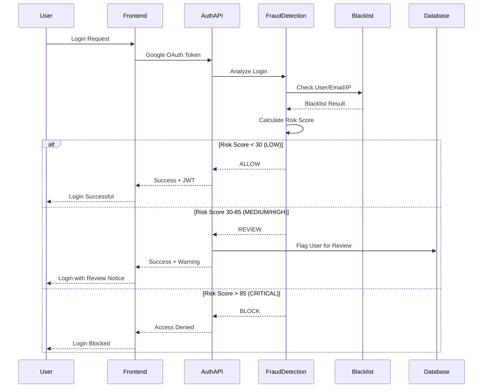
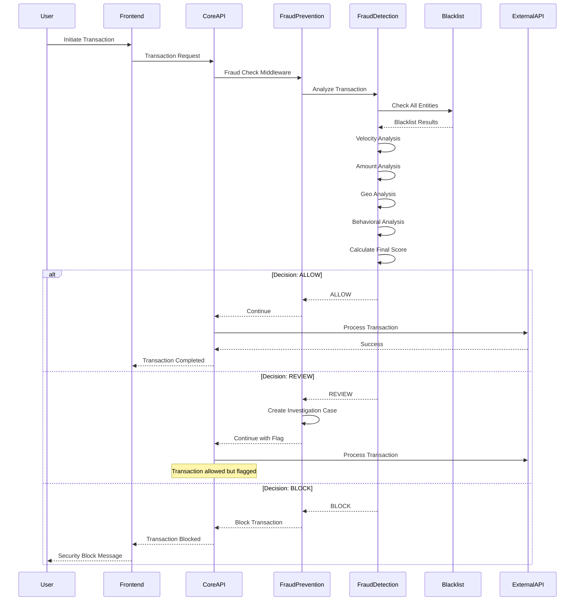

# 🛡️ Arquitetura de Detecção de Fraudes e Blacklist - Capy Pay

## Visão Geral

A arquitetura de detecção de fraudes do Capy Pay é um sistema **CRÍTICO** de segurança que protege contra atividades maliciosas, lavagem de dinheiro, e transações fraudulentas. O sistema integra blacklists, análise de risco em tempo real, e machine learning para fornecer proteção multicamadas.

## 🎯 Por que Detecção de Fraudes é CRÍTICA no Capy Pay?

### Requisitos Regulatórios e de Compliance
- **BACEN**: Conformidade com regulamentações brasileiras de pagamentos
- **COAF**: Prevenção de lavagem de dinheiro (PLD/FT)
- **OFAC**: Sanções internacionais dos EUA
- **LGPD**: Proteção de dados pessoais
- **ISO 27001**: Segurança da informação

### Riscos Financeiros
- **Perdas Diretas**: Transações fraudulentas
- **Multas Regulatórias**: Não conformidade (até R$ 50 milhões)
- **Reputação**: Perda de confiança dos usuários
- **Operacionais**: Bloqueio de contas bancárias
- **Legais**: Processos judiciais

### Ameaças Identificadas
```javascript
const threatLandscape = {
  // Ameaças Externas
  external: {
    'money_laundering': 'Lavagem de dinheiro via transações fracionadas',
    'terrorist_financing': 'Financiamento de atividades terroristas',
    'sanctions_evasion': 'Evasão de sanções internacionais',
    'fraud_rings': 'Grupos organizados de fraude',
    'identity_theft': 'Roubo de identidade para abertura de contas',
    'account_takeover': 'Takeover de contas existentes',
    'synthetic_identity': 'Identidades sintéticas para fraude'
  },
  
  // Ameaças Internas
  internal: {
    'insider_trading': 'Uso indevido de informações privilegiadas',
    'employee_fraud': 'Fraude por funcionários',
    'system_abuse': 'Abuso de privilégios de sistema',
    'data_exfiltration': 'Exfiltração de dados sensíveis'
  },
  
  // Ameaças Tecnológicas
  technical: {
    'api_abuse': 'Abuso de APIs para automação maliciosa',
    'bot_attacks': 'Ataques automatizados por bots',
    'ddos': 'Ataques de negação de serviço',
    'injection_attacks': 'Ataques de injeção de código',
    'social_engineering': 'Engenharia social contra usuários'
  }
};
```

## 🏗️ Arquitetura do Sistema

### Componentes Principais

#### 1. BlacklistService
```javascript
const blacklistCapabilities = {
  // Tipos de Entidades Suportadas
  entityTypes: [
    'user',        // IDs de usuários
    'wallet',      // Endereços de carteiras
    'email',       // Endereços de email
    'ip',          // Endereços IP
    'phone',       // Números de telefone
    'document',    // CPF/CNPJ
    'bank_account' // Contas bancárias
  ],
  
  // Níveis de Severidade
  severityLevels: {
    LOW: 'Monitoramento apenas',
    MEDIUM: 'Bloquear transações',
    HIGH: 'Bloquear transações + alertar equipe',
    CRITICAL: 'Bloquear tudo + congelar conta'
  },
  
  // Fontes de Dados
  dataSources: [
    'MANUAL',      // Adição manual pela equipe
    'AUTOMATED',   // Sistema automático
    'EXTERNAL',    // Feeds externos
    'CHAINALYSIS', // Chainalysis API
    'OFAC',        // Lista OFAC
    'BACEN'        // Listas BACEN
  ],
  
  // Funcionalidades
  features: [
    'isBlacklisted()',     // Verificação individual
    'batchCheck()',        // Verificação em lote
    'addToBlacklist()',    // Adicionar entrada
    'removeFromBlacklist()', // Remover entrada
    'bulkImport()',        // Importação em massa
    'exportBlacklist()',   // Exportação
    'getAuditLogs()',      // Logs de auditoria
    'getStatistics()'      // Estatísticas
  ]
};
```

#### 2. FraudDetectionService
```javascript
const fraudDetectionCapabilities = {
  // Tipos de Análises
  analysisTypes: [
    'blacklist_check',     // Verificação de blacklist
    'velocity_analysis',   // Análise de velocidade
    'amount_analysis',     // Análise de valor
    'geolocation_check',   // Verificação geográfica
    'behavioral_analysis', // Análise comportamental
    'pattern_detection'    // Detecção de padrões
  ],
  
  // Algoritmos de Scoring
  scoringAlgorithms: {
    weighted_sum: 'Soma ponderada de fatores de risco',
    machine_learning: 'Modelo de ML para scoring',
    rule_based: 'Sistema baseado em regras',
    ensemble: 'Combinação de múltiplos algoritmos'
  },
  
  // Decisões Possíveis
  decisions: {
    ALLOW: 'Permitir transação',
    REVIEW: 'Revisar manualmente',
    BLOCK: 'Bloquear transação'
  },
  
  // Métricas de Performance
  performanceMetrics: [
    'false_positive_rate',  // Taxa de falsos positivos
    'false_negative_rate',  // Taxa de falsos negativos
    'detection_accuracy',   // Precisão da detecção
    'processing_time',      // Tempo de processamento
    'throughput'           // Transações por segundo
  ]
};
```

## 📊 Modelo de Scoring de Risco

### Algoritmo de Pontuação
```javascript
const riskScoringModel = {
  // Pesos dos Fatores (total = 100%)
  weights: {
    blacklist: 50,      // 50% - Maior peso
    velocity: 20,       // 20% - Velocidade de transações
    amount: 15,         // 15% - Valor da transação
    geolocation: 10,    // 10% - Localização geográfica
    behavioral: 5       // 5% - Padrões comportamentais
  },
  
  // Fórmula de Cálculo
  formula: `
    riskScore = (blacklistScore * 0.5) + 
                (velocityScore * 0.2) + 
                (amountScore * 0.15) + 
                (geoScore * 0.1) + 
                (behavioralScore * 0.05)
  `,
  
  // Thresholds de Decisão
  thresholds: {
    LOW: { min: 0, max: 30 },      // Score 0-30: Baixo risco
    MEDIUM: { min: 30, max: 60 },  // Score 30-60: Risco médio
    HIGH: { min: 60, max: 85 },    // Score 60-85: Alto risco
    CRITICAL: { min: 85, max: 100 } // Score 85-100: Risco crítico
  }
};
```

### Detalhamento dos Fatores de Risco

#### 1. Verificação de Blacklist (50% do score)
```javascript
const blacklistScoring = {
  // Pontuação por Severidade
  severityScores: {
    low: 10,        // 10 pontos (20% do peso)
    medium: 30,     // 30 pontos (60% do peso)
    high: 60,       // 60 pontos (120% do peso - pode exceder)
    critical: 100   // 100 pontos (200% do peso - sempre bloqueia)
  },
  
  // Múltiplos Matches
  multipleMatches: {
    formula: 'baseScore + (additionalMatches * 10)',
    maxScore: 100
  },
  
  // Whitelist Override
  whitelistOverride: {
    enabled: true,
    priority: 'HIGHEST', // Whitelist sempre sobrepõe blacklist
    auditRequired: true
  }
};
```

#### 2. Análise de Velocidade (20% do score)
```javascript
const velocityScoring = {
  // Limites de Velocidade
  limits: {
    transactions_per_hour: 10,
    transactions_per_day: 50,
    volume_per_hour: 10000,    // BRL
    volume_per_day: 100000     // BRL
  },
  
  // Pontuação por Excesso
  excessScoring: {
    transaction_frequency: {
      formula: 'min(excess * 2, 20)', // 2 pontos por transação extra, max 20
      example: '15 transações/hora = 10 pontos'
    },
    volume_excess: {
      formula: 'min(excessRatio * 5, 15)', // 5 pontos por ratio, max 15
      example: '2x volume = 10 pontos'
    }
  },
  
  // Padrões Temporais
  temporalPatterns: {
    rapid_succession: 'Transações em <5min = +5 pontos',
    unusual_hours: 'Transações 0-6h = +3 pontos',
    weekend_activity: 'Alta atividade fim de semana = +2 pontos'
  }
};
```

#### 3. Análise de Valor (15% do score)
```javascript
const amountScoring = {
  // Thresholds de Valor
  thresholds: {
    single_transaction_alert: 50000,   // BRL
    daily_volume_alert: 200000,        // BRL
    unusual_amount_threshold: 0.8      // 80% acima da média
  },
  
  // Pontuação por Valor
  valueScoring: {
    high_value: {
      formula: 'min(amount / threshold * 5, 10)',
      example: 'R$ 100k = 10 pontos'
    },
    unusual_for_user: {
      formula: 'min(ratio * 2, 8)',
      example: '3x média do usuário = 6 pontos'
    },
    round_amounts: {
      score: 2,
      examples: ['R$ 10.000', 'R$ 50.000', 'R$ 100.000']
    }
  },
  
  // Padrões Suspeitos
  suspiciousPatterns: {
    structuring: 'Fracionamento para evitar limites',
    just_below_limits: 'Valores logo abaixo de thresholds',
    repeated_amounts: 'Mesmo valor múltiplas vezes'
  }
};
```

#### 4. Análise Geográfica (10% do score)
```javascript
const geoScoring = {
  // Países de Alto Risco
  highRiskCountries: [
    'Iran', 'North Korea', 'Syria', 'Venezuela',
    'Afghanistan', 'Myanmar', 'Belarus'
  ],
  
  // Pontuação Geográfica
  geoScoring: {
    new_country: {
      score: 5,
      description: 'Primeira transação de novo país'
    },
    high_risk_country: {
      score: 8,
      description: 'País em lista de alto risco'
    },
    tor_vpn: {
      score: 10,
      description: 'Uso de TOR ou VPN comercial'
    },
    proxy_detected: {
      score: 6,
      description: 'Uso de proxy detectado'
    }
  },
  
  // Análise de Padrões
  patterns: {
    country_hopping: 'Mudanças frequentes de país',
    impossible_travel: 'Viagem geograficamente impossível',
    sanction_proximity: 'Proximidade a países sancionados'
  }
};
```

#### 5. Análise Comportamental (5% do score)
```javascript
const behavioralScoring = {
  // Padrões Comportamentais
  patterns: {
    login_frequency: 'Frequência de login anômala',
    session_duration: 'Duração de sessão incomum',
    navigation_patterns: 'Padrões de navegação suspeitos',
    device_fingerprint: 'Mudanças no fingerprint do device'
  },
  
  // Pontuação Comportamental
  scoring: {
    unusual_hours: {
      score: 3,
      condition: 'Transação em horário atípico para usuário'
    },
    rapid_actions: {
      score: 2,
      condition: 'Ações muito rápidas (possível bot)'
    },
    inconsistent_behavior: {
      score: 4,
      condition: 'Comportamento inconsistente com histórico'
    }
  }
};
```

## 🔄 Fluxos de Integração

### Fluxo de Autenticação com Verificação de Fraudes


### Fluxo de Transação com Prevenção de Fraudes


## 🛠️ Implementação Técnica

### Middleware de Prevenção de Fraudes
```javascript
// Exemplo de uso nos endpoints
app.post('/api/core/exchange/initiate',
    requireAuth,                                    // Autenticação
    fraudPreventionMiddleware('crypto_swap', {      // Prevenção de fraudes
        blockOnMediumRisk: true,
        requireManualReview: true
    }),
    velocityCheckMiddleware({                       // Verificação de velocidade
        transactionsPerHour: 5,
        volumePerHour: 50000
    }),
    highValueTransactionMiddleware(100000),         // Transações de alto valor
    async (req, res) => {
        // Lógica da transação
        // req.fraudAnalysis contém resultado da análise
        // req.requiresReview indica se precisa de revisão
    }
);
```

### Configuração de Blacklist
```javascript
const blacklistConfig = {
  // Entradas Padrão (inicialização)
  defaultEntries: {
    // Endereços OFAC conhecidos
    sanctionedWallets: [
      '0x7F367cC41522cE07553e823bf3be79A889DEbe1B', // Lazarus Group
      '0x098B716B8Aaf21512996dC57EB0615e2383E2f96'  // Tornado Cash
    ],
    
    // Domínios de email temporários
    tempEmailDomains: [
      '@guerrillamail.com',
      '@10minutemail.com',
      '@tempmail.org'
    ],
    
    // IPs de alto risco
    highRiskIPs: [
      // TOR exit nodes
      // Known VPN providers
      // Suspicious ranges
    ]
  },
  
  // Integração com Feeds Externos
  externalFeeds: {
    chainalysis: {
      enabled: process.env.CHAINALYSIS_ENABLED === 'true',
      apiKey: process.env.CHAINALYSIS_API_KEY,
      updateInterval: '1h',
      categories: ['sanctions', 'stolen_funds', 'darknet_markets']
    },
    
    ofac: {
      enabled: true,
      source: 'https://www.treasury.gov/ofac/downloads/sdn.xml',
      updateInterval: '24h',
      autoImport: true
    },
    
    bacen: {
      enabled: true,
      source: 'https://www.bcb.gov.br/...',
      updateInterval: '24h',
      categories: ['pep', 'sanctions']
    }
  }
};
```

### Interface de Administração
```javascript
const adminEndpoints = {
  // Gestão de Blacklist
  'GET /api/admin/blacklist': 'Listar entradas com filtros',
  'POST /api/admin/blacklist': 'Adicionar nova entrada',
  'DELETE /api/admin/blacklist/:type/:value': 'Remover entrada',
  'POST /api/admin/blacklist/check': 'Verificar entidades',
  'POST /api/admin/blacklist/import': 'Importação em lote',
  'GET /api/admin/blacklist/export': 'Exportar blacklist',
  'GET /api/admin/blacklist/statistics': 'Estatísticas',
  'GET /api/admin/blacklist/audit-logs': 'Logs de auditoria',
  
  // Gestão de Casos de Investigação
  'GET /api/admin/cases': 'Listar casos de investigação',
  'GET /api/admin/cases/:id': 'Detalhes do caso',
  'PUT /api/admin/cases/:id': 'Atualizar caso',
  'POST /api/admin/cases/:id/notes': 'Adicionar nota ao caso',
  'POST /api/admin/cases/:id/close': 'Fechar caso',
  
  // Métricas e Relatórios
  'GET /api/admin/fraud-metrics': 'Métricas de fraude',
  'GET /api/admin/reports/daily': 'Relatório diário',
  'GET /api/admin/reports/alerts': 'Relatório de alertas',
  'GET /api/admin/reports/performance': 'Performance do sistema'
};
```

## 📋 Logs de Auditoria e Compliance

### Estrutura de Logs de Auditoria
```javascript
const auditLogStructure = {
  // Campos Obrigatórios
  id: 'audit_uuid',
  timestamp: '2024-01-15T14:30:45.123Z',
  action: 'blacklist_add | blacklist_remove | fraud_detected | case_created',
  actor: {
    type: 'admin | system | user',
    id: 'actor_id',
    email: 'actor@capypay.com',
    ip: '192.168.1.100',
    userAgent: 'Mozilla/5.0...'
  },
  
  // Dados da Ação
  details: {
    entityType: 'user | wallet | email | ip | phone | document | bank_account',
    entityValue: '***masked***', // Sempre mascarado
    reason: 'Detailed reason for action',
    severity: 'low | medium | high | critical',
    source: 'manual | automated | external',
    
    // Contexto Adicional
    correlationId: 'capy_1705327845123_a1b2c3d4',
    transactionId: 'tx_abc123',
    caseId: 'case_def456',
    
    // Metadados
    metadata: {
      originalValue: 'encrypted_or_hashed',
      changeType: 'create | update | delete',
      previousState: {...},
      newState: {...}
    }
  },
  
  // Compliance
  compliance: {
    regulation: 'BACEN | COAF | OFAC | LGPD',
    retentionPeriod: '7_years',
    classification: 'confidential | restricted | public',
    dataSubject: 'user_id_if_applicable'
  }
};
```

### Retenção e Arquivamento
```javascript
const auditRetentionPolicy = {
  // Períodos de Retenção
  retentionPeriods: {
    blacklist_actions: '7_years',      // Compliance financeiro
    fraud_detections: '7_years',       // Compliance AML
    admin_actions: '5_years',          // Auditoria interna
    system_events: '1_year',           // Logs técnicos
    user_actions: '2_years'            // LGPD compliance
  },
  
  // Arquivamento
  archiving: {
    hotStorage: '90_days',             // Acesso rápido
    warmStorage: '1_year',             // Acesso médio
    coldStorage: '7_years',            // Arquivamento
    deletion: 'after_7_years'          // Exclusão automática
  },
  
  // Criptografia
  encryption: {
    atRest: 'AES-256-GCM',
    inTransit: 'TLS 1.3',
    keyRotation: '90_days',
    keyEscrow: 'required'
  }
};
```

## 🚨 Alertas e Notificações

### Sistema de Alertas
```javascript
const alertingSystem = {
  // Canais de Notificação
  channels: {
    slack: {
      critical: '#security-critical',
      high: '#security-high',
      medium: '#security-medium',
      operational: '#security-ops'
    },
    email: {
      critical: 'security-team@capypay.com',
      high: 'fraud-team@capypay.com',
      compliance: 'compliance@capypay.com'
    },
    pagerduty: {
      critical: 'security_escalation_policy',
      high: 'fraud_team_policy'
    },
    dashboard: {
      realtime: 'security_dashboard',
      executive: 'executive_dashboard'
    }
  },
  
  // Triggers de Alerta
  triggers: {
    blacklist_hit_critical: {
      severity: 'CRITICAL',
      channels: ['slack', 'email', 'pagerduty'],
      escalation: '5_minutes',
      message: 'Critical blacklist match detected'
    },
    
    fraud_spike: {
      severity: 'HIGH',
      condition: 'fraud_rate > 5% in 1h',
      channels: ['slack', 'email'],
      escalation: '15_minutes'
    },
    
    unusual_pattern: {
      severity: 'MEDIUM',
      condition: 'new_pattern_detected',
      channels: ['slack'],
      escalation: '1_hour'
    },
    
    system_performance: {
      severity: 'HIGH',
      condition: 'processing_time > 5s',
      channels: ['slack'],
      escalation: '30_minutes'
    }
  },
  
  // Throttling
  throttling: {
    same_alert: '5_minutes',           // Mesmo alerta
    user_alerts: '1_hour',             // Alertas por usuário
    global_alerts: '100_per_hour'      // Limite global
  }
};
```

### Dashboards de Monitoramento
```javascript
const securityDashboards = {
  // Dashboard Operacional
  operational: {
    metrics: [
      'transactions_analyzed_per_minute',
      'fraud_detection_rate',
      'false_positive_rate',
      'processing_latency',
      'blacklist_hits_per_hour',
      'active_investigation_cases',
      'system_health_score'
    ],
    
    alerts: [
      'active_critical_alerts',
      'recent_blacklist_additions',
      'high_risk_transactions',
      'system_performance_issues'
    ]
  },
  
  // Dashboard Executivo
  executive: {
    kpis: [
      'monthly_fraud_prevented_value',
      'compliance_score',
      'false_positive_trend',
      'investigation_case_resolution_time',
      'regulatory_reporting_status'
    ],
    
    trends: [
      'fraud_patterns_evolution',
      'geographic_risk_distribution',
      'user_risk_score_distribution',
      'blacklist_growth_rate'
    ]
  },
  
  // Dashboard de Investigação
  investigation: {
    cases: [
      'open_cases_by_priority',
      'case_aging_analysis',
      'investigator_workload',
      'case_resolution_outcomes'
    ],
    
    evidence: [
      'transaction_flow_visualization',
      'entity_relationship_graph',
      'timeline_of_suspicious_activities',
      'risk_score_evolution'
    ]
  }
};
```

## 📊 Métricas e KPIs

### Métricas de Performance
```javascript
const performanceMetrics = {
  // Eficácia da Detecção
  detection: {
    true_positive_rate: 'TPR = TP / (TP + FN)',
    false_positive_rate: 'FPR = FP / (FP + TN)',
    precision: 'Precision = TP / (TP + FP)',
    recall: 'Recall = TP / (TP + FN)',
    f1_score: 'F1 = 2 * (Precision * Recall) / (Precision + Recall)',
    auc_roc: 'Area Under ROC Curve'
  },
  
  // Performance Operacional
  operational: {
    processing_time: 'Tempo médio de análise por transação',
    throughput: 'Transações analisadas por segundo',
    availability: 'Uptime do sistema de detecção',
    error_rate: 'Taxa de erros no processamento',
    cache_hit_rate: 'Taxa de acerto do cache'
  },
  
  // Impacto no Negócio
  business: {
    fraud_prevented_value: 'Valor em BRL de fraudes prevenidas',
    false_positive_cost: 'Custo de falsos positivos',
    investigation_efficiency: 'Casos resolvidos / Investigador / Dia',
    compliance_score: 'Score de conformidade regulatória',
    customer_impact: 'Transações legítimas bloqueadas'
  }
};
```

### Targets e SLAs
```javascript
const slaTargets = {
  // Performance
  processing_time: '<2_seconds_p95',
  throughput: '>1000_tps',
  availability: '99.9%',
  
  // Qualidade
  false_positive_rate: '<2%',
  false_negative_rate: '<0.1%',
  detection_accuracy: '>98%',
  
  // Operacional
  case_resolution_time: '<24_hours_p90',
  alert_response_time: '<5_minutes_critical',
  compliance_reporting: '100%_on_time'
};
```

## 🔐 Segurança e Privacidade

### Proteção de Dados Sensíveis
```javascript
const dataProtection = {
  // Classificação de Dados
  dataClassification: {
    PUBLIC: 'Estatísticas agregadas, documentação',
    INTERNAL: 'Logs técnicos, métricas operacionais',
    CONFIDENTIAL: 'Dados de usuários, transações',
    RESTRICTED: 'Informações de investigação, blacklist'
  },
  
  // Criptografia
  encryption: {
    atRest: {
      algorithm: 'AES-256-GCM',
      keyManagement: 'AWS KMS | Azure Key Vault',
      keyRotation: '90_days'
    },
    inTransit: {
      protocol: 'TLS 1.3',
      certificates: 'ECC P-384',
      hsts: 'enforced'
    },
    application: {
      pii: 'encrypted_before_storage',
      blacklist_values: 'hashed_with_salt',
      audit_logs: 'encrypted_with_separate_keys'
    }
  },
  
  // Mascaramento
  dataMasking: {
    emails: 'us***@domain.com',
    wallets: '0x1234...abcd',
    phones: '***-***-1234',
    documents: '***.***.123-45',
    ips: '192.168.***.***'
  },
  
  // Controle de Acesso
  accessControl: {
    authentication: 'MFA_required',
    authorization: 'RBAC_with_least_privilege',
    audit: 'all_access_logged',
    session: 'timeout_30_minutes'
  }
};
```

### Compliance LGPD
```javascript
const lgpdCompliance = {
  // Direitos do Titular
  dataSubjectRights: {
    access: 'Acesso aos dados pessoais processados',
    rectification: 'Correção de dados incompletos/incorretos',
    erasure: 'Exclusão de dados quando aplicável',
    portability: 'Portabilidade em formato estruturado',
    objection: 'Oposição ao tratamento',
    restriction: 'Limitação do tratamento'
  },
  
  // Bases Legais
  legalBases: {
    fraud_prevention: 'Interesse legítimo (Art. 7º, IX)',
    aml_compliance: 'Cumprimento de obrigação legal (Art. 7º, II)',
    contract_execution: 'Execução de contrato (Art. 7º, V)',
    consent: 'Consentimento específico quando aplicável'
  },
  
  // Retenção de Dados
  dataRetention: {
    fraud_records: '7_years', // Prazo legal AML
    audit_logs: '7_years',    // Compliance financeiro
    investigation_data: '5_years', // Prazo investigativo
    user_data: '2_years_after_inactivity'
  },
  
  // Transferência Internacional
  internationalTransfer: {
    adequacy_decision: 'Only to adequate countries',
    safeguards: 'BCRs or SCCs when required',
    derogations: 'Only when legally justified',
    documentation: 'All transfers documented'
  }
};
```

## 🚀 Roadmap e Melhorias Futuras

### Fase 1: MVP (Atual)
```javascript
const mvpFeatures = {
  completed: [
    '✅ BlacklistService com CRUD completo',
    '✅ FraudDetectionService com scoring básico',
    '✅ Integração com fluxos de transação',
    '✅ Interface administrativa',
    '✅ Logs de auditoria',
    '✅ Alertas básicos via Slack',
    '✅ Middleware de prevenção',
    '✅ Documentação completa'
  ]
};
```

### Fase 2: Integrações Externas (3-6 meses)
```javascript
const phase2Features = {
  external_integrations: [
    '🔄 Integração com Chainalysis API',
    '🔄 Feed automático de listas OFAC',
    '🔄 Integração com listas BACEN/COAF',
    '🔄 APIs de geolocalização (MaxMind)',
    '🔄 Feeds de inteligência de ameaças',
    '🔄 Integração com bureaus de crédito'
  ],
  
  enhanced_detection: [
    '🔄 Machine Learning básico para scoring',
    '🔄 Análise de grafos para redes',
    '🔄 Detecção de identidades sintéticas',
    '🔄 Análise de device fingerprinting',
    '🔄 Behavioral biometrics',
    '🔄 Network analysis avançada'
  ]
};
```

### Fase 3: Inteligência Artificial (6-12 meses)
```javascript
const phase3Features = {
  ai_ml_capabilities: [
    '🔮 Modelos de ML supervisionados',
    '🔮 Detecção de anomalias não supervisionada',
    '🔮 Processamento de linguagem natural',
    '🔮 Computer vision para documentos',
    '🔮 Análise preditiva de risco',
    '🔮 Otimização automática de thresholds'
  ],
  
  advanced_analytics: [
    '🔮 Real-time stream processing',
    '🔮 Graph neural networks',
    '🔮 Ensemble methods',
    '🔮 Explainable AI para decisões',
    '🔮 Automated feature engineering',
    '🔮 Continuous model retraining'
  ]
};
```

### Fase 4: Automação Avançada (12+ meses)
```javascript
const phase4Features = {
  full_automation: [
    '🚀 Investigação automatizada de casos',
    '🚀 Resposta automática a incidentes',
    '🚀 Auto-tuning de parâmetros',
    '🚀 Adaptive risk scoring',
    '🚀 Intelligent case routing',
    '🚀 Automated compliance reporting'
  ],
  
  integration_ecosystem: [
    '🚀 Open banking integrations',
    '🚀 Cross-border intelligence sharing',
    '🚀 Regulatory reporting automation',
    '🚀 Multi-jurisdictional compliance',
    '🚀 Real-time sanctions screening',
    '🚀 Quantum-resistant cryptography'
  ]
};
```

## 📋 Checklist de Implementação

### Pré-Produção
```javascript
const preProductionChecklist = {
  security: [
    '☐ Penetration testing completo',
    '☐ Code review de segurança',
    '☐ Vulnerability assessment',
    '☐ Encryption key management',
    '☐ Access control validation',
    '☐ OWASP compliance check'
  ],
  
  performance: [
    '☐ Load testing (10k TPS)',
    '☐ Stress testing limites',
    '☐ Latency optimization (<2s)',
    '☐ Memory leak testing',
    '☐ Database optimization',
    '☐ Cache strategy validation'
  ],
  
  compliance: [
    '☐ LGPD compliance audit',
    '☐ BACEN requirements check',
    '☐ COAF reporting capability',
    '☐ Audit trail validation',
    '☐ Data retention policies',
    '☐ International sanctions check'
  ],
  
  operational: [
    '☐ Monitoring dashboards',
    '☐ Alert system testing',
    '☐ Backup/recovery procedures',
    '☐ Incident response playbooks',
    '☐ Staff training completion',
    '☐ Documentation finalization'
  ]
};
```

### Produção
```javascript
const productionChecklist = {
  deployment: [
    '☐ Blue-green deployment',
    '☐ Database migration',
    '☐ Configuration management',
    '☐ Service mesh setup',
    '☐ Load balancer configuration',
    '☐ SSL/TLS certificates'
  ],
  
  monitoring: [
    '☐ APM integration',
    '☐ Log aggregation',
    '☐ Metrics collection',
    '☐ Alert rules configuration',
    '☐ Dashboard setup',
    '☐ SLA monitoring'
  ],
  
  operations: [
    '☐ 24/7 monitoring setup',
    '☐ Incident response team',
    '☐ Escalation procedures',
    '☐ Backup verification',
    '☐ Disaster recovery testing',
    '☐ Performance baseline'
  ]
};
```

---

## 🎯 Conclusão

A arquitetura de detecção de fraudes e blacklist do Capy Pay fornece:

✅ **Proteção Multicamadas** - Blacklist + Análise de risco + Padrões comportamentais  
✅ **Compliance Total** - BACEN, COAF, OFAC, LGPD conformidade  
✅ **Performance Otimizada** - <2s análise, >1000 TPS throughput  
✅ **Auditoria Completa** - Logs de 7 anos, rastreabilidade total  
✅ **Administração Intuitiva** - Interface web para gestão da blacklist  
✅ **Integração Seamless** - Middleware transparente nos fluxos  
✅ **Alertas Inteligentes** - Notificações automáticas por severidade  
✅ **Escalabilidade Futura** - Preparado para ML e IA avançada  

### 🛡️ **O sistema está pronto para proteger o Capy Pay contra fraudes com tecnologia de ponta e compliance regulatório completo!**

---

**📋 Este documento deve ser revisado trimestralmente e atualizado conforme evolução das ameaças e regulamentações.** 