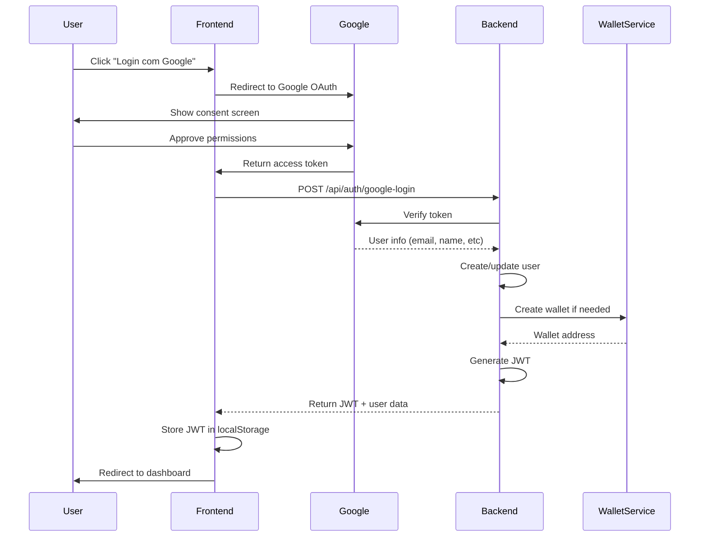

# 🔐 Configuração Google OAuth - Capy Pay

Guia completo para configurar autenticação Google OAuth no Capy Pay.

## 🚀 Configuração no Google Cloud Console

### 1. Criar Projeto no Google Cloud

1. Acesse [Google Cloud Console](https://console.cloud.google.com/)
2. Clique em **"Select a project"** → **"New Project"**
3. Nome do projeto: `capy-pay-oauth`
4. Clique em **"Create"**

### 2. Ativar Google+ API

1. No menu lateral, vá para **"APIs & Services"** → **"Library"**
2. Procure por **"Google+ API"**
3. Clique em **"Enable"**

### 3. Configurar OAuth Consent Screen

1. Vá para **"APIs & Services"** → **"OAuth consent screen"**
2. Escolha **"External"** (para usuários externos)
3. Preencha as informações:

```
App name: Capy Pay
User support email: support@capypay.com
Developer contact information: dev@capypay.com

App domain: https://capypay.com
Authorized domains: 
  - capypay.com
  - vercel.app (se usando Vercel)

Scopes: 
  - email
  - profile
  - openid
```

4. Adicione **Test users** (para desenvolvimento):
   - Adicione emails dos desenvolvedores
   - Máximo 100 usuários em modo teste

### 4. Criar Credenciais OAuth

1. Vá para **"APIs & Services"** → **"Credentials"**
2. Clique em **"Create Credentials"** → **"OAuth 2.0 Client IDs"**
3. Application type: **"Web application"**
4. Name: `capy-pay-web-client`

#### Authorized JavaScript origins:
```
# Desenvolvimento
http://localhost:3000
http://localhost:3001

# Produção
https://capypay.com
https://app.capypay.com
https://capy-pay.vercel.app
```

#### Authorized redirect URIs:
```
# Desenvolvimento
http://localhost:3000/auth/callback
http://localhost:3001/auth/callback

# Produção
https://capypay.com/auth/callback
https://app.capypay.com/auth/callback
```

5. Clique em **"Create"**
6. **Copie e salve**:
   - Client ID
   - Client Secret

## 🔧 Configuração no Backend

### Variáveis de Ambiente

```bash
# .env
GOOGLE_CLIENT_ID=123456789-abcdefghijklmnop.apps.googleusercontent.com
GOOGLE_CLIENT_SECRET=GOCSPX-your_client_secret_here
GOOGLE_REDIRECT_URI=https://your-domain.com/auth/google/callback
```

### Teste da Configuração

```bash
# Testar conectividade
curl -X POST "http://localhost:3001/api/auth/google-login" \
  -H "Content-Type: application/json" \
  -d '{
    "googleToken": "mock_token_for_testing"
  }'
```

## 🌐 Integração Frontend (MiniKit)

### 1. Configuração no Frontend

```javascript
// No componente de login
import { useGoogleLogin } from '@react-oauth/google';

const GoogleLoginButton = () => {
  const login = useGoogleLogin({
    onSuccess: async (response) => {
      // Enviar token para backend
      const result = await fetch('/api/auth/google-login', {
        method: 'POST',
        headers: { 'Content-Type': 'application/json' },
        body: JSON.stringify({
          googleToken: response.access_token,
          miniKitData: {
            worldId: 'world_id_from_minikit',
            appId: process.env.NEXT_PUBLIC_MINIKIT_APP_ID,
            verified: true
          }
        })
      });
      
      const data = await result.json();
      if (data.success) {
        // Login bem-sucedido
        localStorage.setItem('accessToken', data.data.accessToken);
        // Redirecionar para dashboard
      }
    },
    onError: (error) => {
      console.error('Google login failed:', error);
    }
  });

  return (
    <button onClick={login} className="btn-google">
      <span>🔐</span>
      Login com Google
    </button>
  );
};
```

### 2. Provider no App Root

```javascript
// app/layout.tsx ou _app.tsx
import { GoogleOAuthProvider } from '@react-oauth/google';

export default function RootLayout({ children }) {
  return (
    <GoogleOAuthProvider clientId={process.env.NEXT_PUBLIC_GOOGLE_CLIENT_ID}>
      <html lang="pt-BR">
        <body>
          {children}
        </body>
      </html>
    </GoogleOAuthProvider>
  );
}
```

## 🔄 Fluxo Completo de Autenticação

### Sequência de Login



### Estados de Usuário

```javascript
// Possíveis estados após login
const userStates = {
  NEW_USER: 'Primeiro login - criar carteira',
  EXISTING_USER: 'Usuário existente - carteira já criada',
  MINIKIT_PENDING: 'Precisa associar contexto MiniKit',
  KYC_PENDING: 'Precisa completar KYC',
  FULLY_VERIFIED: 'Usuário completamente verificado'
};
```

## 🧪 Testes de Integração

### 1. Teste Manual

```javascript
// Teste no console do navegador
const testGoogleLogin = async () => {
  const mockToken = 'mock_google_token';
  
  const response = await fetch('/api/auth/google-login', {
    method: 'POST',
    headers: { 'Content-Type': 'application/json' },
    body: JSON.stringify({
      googleToken: mockToken,
      miniKitData: {
        worldId: 'test_world_id',
        appId: 'test_app_id',
        verified: true
      }
    })
  });
  
  const result = await response.json();
  console.log('Login result:', result);
};
```

### 2. Teste Automatizado

```javascript
// tests/auth.test.js
const request = require('supertest');
const app = require('../src/server');

describe('Google OAuth', () => {
  test('should authenticate user with valid Google token', async () => {
    const mockGoogleToken = 'valid_mock_token';
    
    const response = await request(app)
      .post('/api/auth/google-login')
      .send({
        googleToken: mockGoogleToken,
        miniKitData: {
          worldId: 'test_world',
          appId: 'test_app',
          verified: true
        }
      });
    
    expect(response.status).toBe(200);
    expect(response.body.success).toBe(true);
    expect(response.body.data.accessToken).toBeDefined();
  });
});
```

## 🔐 Segurança e Melhores Práticas

### Validação de Token

```javascript
// Backend - validação rigorosa
const verifyGoogleToken = async (token) => {
  try {
    const ticket = await googleClient.verifyIdToken({
      idToken: token,
      audience: process.env.GOOGLE_CLIENT_ID
    });
    
    const payload = ticket.getPayload();
    
    // Validações adicionais
    if (!payload.email_verified) {
      throw new Error('Email not verified');
    }
    
    if (payload.aud !== process.env.GOOGLE_CLIENT_ID) {
      throw new Error('Invalid audience');
    }
    
    if (payload.exp < Date.now() / 1000) {
      throw new Error('Token expired');
    }
    
    return payload;
  } catch (error) {
    logger.error('Google token validation failed', { error: error.message });
    return null;
  }
};
```

### Rate Limiting Específico

```javascript
// Rate limiting mais restritivo para login
const loginLimiter = rateLimit({
  windowMs: 15 * 60 * 1000, // 15 minutos
  max: 5, // máximo 5 tentativas
  message: {
    error: 'Too many login attempts, please try again later'
  },
  standardHeaders: true
});

app.use('/api/auth/google-login', loginLimiter);
```

### CSRF Protection

```javascript
// Gerar e validar state parameter
const generateState = () => crypto.randomBytes(32).toString('hex');

// No frontend
const state = generateState();
sessionStorage.setItem('oauth_state', state);

// Incluir state na URL do Google
const googleAuthUrl = `https://accounts.google.com/oauth/authorize?client_id=${CLIENT_ID}&state=${state}`;

// Validar state no callback
const validateState = (receivedState) => {
  const expectedState = sessionStorage.getItem('oauth_state');
  return receivedState === expectedState;
};
```

## 📱 Configuração para MiniKit

### Contexto do World App

```javascript
// Integração com MiniKit
const associateMiniKitContext = async (userId, miniKitData) => {
  const user = await User.findById(userId);
  
  user.miniKit = {
    worldId: miniKitData.worldId,
    appId: miniKitData.appId,
    verified: miniKitData.verified,
    connectedAt: new Date()
  };
  
  if (miniKitData.farcaster) {
    user.farcaster = {
      fid: miniKitData.farcaster.fid,
      username: miniKitData.farcaster.username,
      displayName: miniKitData.farcaster.displayName
    };
  }
  
  await user.save();
  return user;
};
```

### Validação de Contexto

```javascript
// Middleware para validar contexto MiniKit
const requireMiniKitContext = (req, res, next) => {
  const user = req.user;
  
  if (!user.miniKit || !user.miniKit.verified) {
    return res.status(403).json({
      success: false,
      error: 'MiniKit verification required',
      action: 'associate_minikit'
    });
  }
  
  next();
};
```

## 🚀 Deploy em Produção

### Configuração de Domínios

```bash
# Atualizar OAuth settings no Google Console
Authorized JavaScript origins:
- https://capypay.com
- https://app.capypay.com

Authorized redirect URIs:
- https://capypay.com/auth/callback
- https://app.capypay.com/auth/callback
```

### Variáveis de Ambiente Produção

```bash
# Railway/Vercel/Heroku
GOOGLE_CLIENT_ID=production_client_id
GOOGLE_CLIENT_SECRET=production_client_secret
GOOGLE_REDIRECT_URI=https://capypay.com/auth/callback
NODE_ENV=production
```

### Verificação de Domínio

1. No Google Console, vá para **"Domain verification"**
2. Adicione domínios de produção
3. Siga processo de verificação (DNS ou HTML file)

## 🔧 Troubleshooting

### Erros Comuns

#### 1. "Invalid client ID"
```bash
# Verificar se CLIENT_ID está correto
echo $GOOGLE_CLIENT_ID

# Verificar se domínio está autorizado no Google Console
```

#### 2. "Redirect URI mismatch"
```bash
# Verificar se URI está exatamente igual no Google Console
# Incluir protocolo (http/https) e porta se necessário
```

#### 3. "Token verification failed"
```javascript
// Verificar se token não expirou
const payload = jwt.decode(token);
console.log('Token expires at:', new Date(payload.exp * 1000));

// Verificar audience
console.log('Token audience:', payload.aud);
console.log('Expected audience:', process.env.GOOGLE_CLIENT_ID);
```

### Debug Mode

```javascript
// Ativar logs detalhados
if (process.env.NODE_ENV === 'development') {
  logger.level = 'debug';
  
  // Log de tokens (APENAS desenvolvimento)
  logger.debug('Google token received', {
    tokenLength: token.length,
    tokenStart: token.substring(0, 20) + '...'
  });
}
```

---

## ✅ **Checklist de Configuração**

- [ ] Projeto criado no Google Cloud Console
- [ ] Google+ API habilitada
- [ ] OAuth Consent Screen configurado
- [ ] Credenciais OAuth criadas
- [ ] Domínios autorizados configurados
- [ ] Variáveis de ambiente definidas
- [ ] Frontend integrado com biblioteca OAuth
- [ ] Testes de login funcionando
- [ ] Rate limiting configurado
- [ ] Logs de segurança implementados
- [ ] Integração MiniKit testada
- [ ] Deploy em produção validado

---

**🔐 Com essa configuração, o Capy Pay terá autenticação Google OAuth segura e integrada ao MiniKit!** 