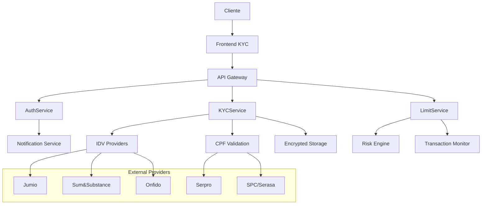

# 🛡️ Arquitetura de Compliance KYC/AML - Capy Pay

## Visão Geral

O sistema de KYC/AML (Know Your Customer/Anti-Money Laundering) do Capy Pay foi projetado para atender às regulamentações brasileiras e internacionais de prevenção à lavagem de dinheiro e financiamento ao terrorismo, garantindo conformidade com as normas do Banco Central do Brasil e outras autoridades reguladoras.

## 📋 Marco Regulatório

### Regulamentações Brasileiras

#### Banco Central do Brasil (BCB)
- **Resolução BCB nº 4.658/2018**: Arranjos de pagamento
- **Circular BCB nº 3.978/2020**: Prevenção à lavagem de dinheiro e ao financiamento do terrorismo
- **Lei nº 9.613/1998**: Lei de Lavagem de Dinheiro (atualizada pela Lei 12.683/2012)
- **Resolução CVM nº 50/2021**: Prestação de serviços de ativos virtuais

#### Proteção de Dados
- **LGPD (Lei 13.709/2018)**: Lei Geral de Proteção de Dados Pessoais
- **Marco Civil da Internet (Lei 12.965/2014)**

#### Outras Normas
- **Receita Federal**: Validação de CPF/CNPJ
- **COAF**: Conselho de Controle de Atividades Financeiras
- **CVM**: Comissão de Valores Mobiliários

### Padrões Internacionais
- **FATF (Financial Action Task Force)**: 40 Recomendações
- **Basel III**: Acordos de Basileia sobre supervisão bancária
- **PCI DSS**: Padrões de segurança para dados de cartão

## 🏗️ Arquitetura do Sistema

### Componentes Principais



### 1. KYCService - Verificação de Identidade

#### Níveis de Verificação

##### Nível 0 (NONE) - Sem Verificação
```javascript
Limites: {
  diário: R$ 250,
  semanal: R$ 1.000,
  mensal: R$ 3.000,
  anual: R$ 12.000
}

Funcionalidades Permitidas:
- Cadastro básico
- Visualização de taxas
- Transações de baixo valor
```

##### Nível 1 (LEVEL_1) - Verificação Básica
```javascript
Requisitos: {
  dados: ['nome_completo', 'cpf', 'data_nascimento', 'telefone', 'email', 'endereco'],
  validações: ['cpf_serpro', 'idade_minima', 'email_verificado'],
  tempo_estimado: '5-10 minutos'
}

Limites: {
  diário: R$ 2.500,
  semanal: R$ 10.000,
  mensal: R$ 30.000,
  anual: R$ 120.000
}

Funcionalidades Adicionais:
- Swaps básicos
- Pagamento de boletos
- Transferências P2P limitadas
```

##### Nível 2 (LEVEL_2) - Verificação Completa
```javascript
Requisitos: {
  documentos: ['documento_oficial', 'selfie_documento', 'comprovante_residencia'],
  validações: ['biometria_facial', 'autenticidade_documento', 'liveness_check'],
  provedores: ['Jumio', 'Sum&Substance', 'Onfido'],
  tempo_estimado: '10-30 minutos'
}

Limites: {
  diário: R$ 25.000,
  semanal: R$ 100.000,
  mensal: R$ 300.000,
  anual: R$ 1.200.000
}

Funcionalidades Adicionais:
- Swaps de alto valor
- Saques internacionais
- Trading avançado
- Cartão de débito crypto
```

##### Nível 3 (LEVEL_3) - Verificação Premium
```javascript
Requisitos: {
  financeiros: ['comprovante_renda', 'declaracao_fonte_recursos', 'patrimonio'],
  validações: ['analise_risco', 'compatibilidade_renda', 'fonte_licita'],
  tempo_estimado: '1-3 dias úteis'
}

Limites: {
  diário: R$ 100.000,
  semanal: R$ 500.000,
  mensal: R$ 1.500.000,
  anual: R$ 6.000.000
}

Funcionalidades Premium:
- Trading institucional
- OTC (Over-the-Counter)
- Produtos de investimento
- Serviços corporativos
```

### 2. LimitService - Gestão de Limites

#### Tipos de Limite

##### Por Período
```javascript
const períodos = {
  DIÁRIO: { horas: 24, reset: 'rolling' },
  SEMANAL: { horas: 168, reset: 'rolling' },
  MENSAL: { horas: 720, reset: 'calendar' },
  ANUAL: { horas: 8760, reset: 'calendar' }
};
```

##### Por Tipo de Transação
```javascript
const multiplicadores_risco = {
  DEPOSIT: 0.8,        // Menor risco
  SWAP: 1.0,           // Risco padrão
  WITHDRAWAL: 1.5,     // Maior risco
  BILL_PAYMENT: 1.2,   // Risco moderado
  P2P_TRANSFER: 1.8    // Alto risco
};
```

#### Engine de Análise de Risco

##### Fatores de Risco
```javascript
const fatores_risco = {
  // Comportamentais
  multiplas_transacoes_rapidas: 25,
  valores_redondos_altos: 15,
  estruturacao_transacoes: 20,
  horario_atipico: 10,
  mudanca_comportamento: 30,
  
  // Técnicos
  ip_alto_risco: 20,
  vpn_proxy_detectado: 25,
  device_novo: 15,
  geolocalizacao_suspeita: 20,
  
  // Financeiros
  renda_incompativel: 35,
  fonte_renda_indefinida: 25,
  patrimonio_desproporcional: 30
};
```

##### Matriz de Decisão
```javascript
const decisao_risco = {
  0-30: 'APROVAR_AUTOMATICO',
  31-50: 'APROVAR_COM_MONITORAMENTO',
  51-70: 'REVISAR_MANUAL',
  71-85: 'SOLICITAR_DOCUMENTACAO_ADICIONAL',
  86-100: 'BLOQUEAR_TEMPORARIAMENTE'
};
```

## 🔐 Segurança e Proteção de Dados

### Criptografia de Dados Sensíveis

#### Dados em Repouso
```javascript
// AES-256-GCM com chaves gerenciadas por HSM/KMS
const encryption = {
  algorithm: 'aes-256-gcm',
  keyManagement: 'AWS_KMS', // ou Azure Key Vault
  keyRotation: '90_days',
  backupEncryption: 'separate_key'
};

// Campos criptografados
const encrypted_fields = [
  'cpf', 'rg', 'passaporte',
  'endereco_completo',
  'telefone',
  'dados_bancarios',
  'biometria_hash',
  'documento_images_hash'
];
```

#### Dados em Trânsito
```javascript
const transport_security = {
  tls_version: 'TLS 1.3',
  certificate_pinning: true,
  hsts_enabled: true,
  cipher_suites: ['ECDHE-RSA-AES256-GCM-SHA384'],
  perfect_forward_secrecy: true
};
```

### Controles de Acesso

#### Princípio do Menor Privilégio
```javascript
const access_roles = {
  KYC_ANALYST: {
    permissions: ['read_kyc_data', 'update_kyc_status'],
    data_access: ['basic_info', 'documents', 'verification_history'],
    time_based_access: true,
    audit_all_actions: true
  },
  
  COMPLIANCE_OFFICER: {
    permissions: ['read_all_kyc', 'approve_high_risk', 'generate_reports'],
    data_access: ['full_profile', 'risk_scores', 'transaction_patterns'],
    approval_limits: 'unlimited',
    dual_control: true
  },
  
  SYSTEM_ADMIN: {
    permissions: ['system_config', 'key_management'],
    data_access: ['system_logs', 'encrypted_keys'],
    mfa_required: true,
    session_timeout: '15_minutes'
  }
};
```

### Auditoria e Logs

#### Eventos Auditados
```javascript
const audit_events = {
  // KYC Events
  KYC_INITIATED: { retention: '7_years', pii_data: false },
  KYC_APPROVED: { retention: '7_years', pii_data: false },
  KYC_REJECTED: { retention: '7_years', pii_data: false },
  DOCUMENT_UPLOADED: { retention: '7_years', pii_data: true },
  
  // Access Events
  SENSITIVE_DATA_ACCESSED: { retention: '3_years', pii_data: false },
  ADMIN_ACTION: { retention: '5_years', pii_data: false },
  FAILED_LOGIN: { retention: '1_year', pii_data: false },
  
  // Transaction Events
  LIMIT_EXCEEDED: { retention: '5_years', pii_data: false },
  SUSPICIOUS_ACTIVITY: { retention: '7_years', pii_data: false },
  HIGH_VALUE_TRANSACTION: { retention: '7_years', pii_data: false }
};
```

## 📊 Monitoramento e Alertas

### Sistema de Alertas Automáticos

#### Alertas de Compliance
```javascript
const compliance_alerts = {
  // Transacionais
  LIMITE_DIARIO_90_PORCENTO: {
    threshold: 0.9,
    action: 'notify_user',
    escalation: 'none'
  },
  
  MULTIPLAS_TENTATIVAS_KYC: {
    threshold: 3,
    timeframe: '24_hours',
    action: 'block_temporarily',
    escalation: 'compliance_team'
  },
  
  PADRAO_ESTRUTURACAO: {
    algorithm: 'ml_detection',
    confidence: 0.8,
    action: 'flag_for_review',
    escalation: 'senior_analyst'
  },
  
  // Técnicos
  FALHA_VALIDACAO_CPF: {
    consecutive_failures: 5,
    action: 'block_user',
    escalation: 'security_team'
  },
  
  IP_ALTO_RISCO: {
    risk_score: 80,
    action: 'additional_verification',
    escalation: 'risk_team'
  }
};
```

### Dashboard de Compliance

#### Métricas em Tempo Real
```javascript
const compliance_metrics = {
  // KYC Performance
  kyc_completion_rate: 'percentage',
  average_verification_time: 'minutes',
  rejection_rate_by_level: 'percentage',
  
  // Risk Indicators
  high_risk_users_percentage: 'percentage',
  suspicious_activity_alerts: 'count',
  false_positive_rate: 'percentage',
  
  // Operational
  manual_review_queue: 'count',
  sla_compliance: 'percentage',
  system_uptime: 'percentage'
};
```

## 🚨 Gestão de Incidentes

### Procedimentos de Resposta

#### Classificação de Incidentes
```javascript
const incident_classification = {
  CRITICO: {
    examples: ['vazamento_dados_pii', 'fraude_confirmada', 'violacao_regulatoria'],
    response_time: '15_minutes',
    escalation: 'ceo_cto_compliance',
    external_notification: 'required'
  },
  
  ALTO: {
    examples: ['falso_positivo_alto_volume', 'sistema_kyc_indisponivel'],
    response_time: '1_hour',
    escalation: 'compliance_manager',
    external_notification: 'conditional'
  },
  
  MEDIO: {
    examples: ['lentidao_verificacao', 'erro_integracao_terceiros'],
    response_time: '4_hours',
    escalation: 'team_lead',
    external_notification: 'not_required'
  }
};
```

#### Plano de Continuidade
```javascript
const business_continuity = {
  // Backup Systems
  kyc_service_backup: {
    provider: 'secondary_idv_provider',
    activation_time: '30_minutes',
    capacity: '80_percent'
  },
  
  // Manual Processes
  manual_verification: {
    trigger: 'system_unavailable_2_hours',
    team_size: '5_analysts',
    max_capacity: '100_verifications_day'
  },
  
  // Data Recovery
  data_backup: {
    frequency: 'real_time',
    retention: '7_years',
    recovery_time: '4_hours',
    recovery_point: '15_minutes'
  }
};
```

## 📋 Relatórios Regulatórios

### Relatórios Obrigatórios

#### COAF (Conselho de Controle de Atividades Financeiras)
```javascript
const coaf_reports = {
  RIF: { // Relatório de Informações Financeiras
    frequency: 'monthly',
    threshold: 'R$ 10.000',
    format: 'XML_COAF',
    deadline: '15_days_after_month'
  },
  
  COMUNICACAO_SUSPEITA: {
    trigger: 'suspicious_activity_confirmed',
    timeframe: '24_hours',
    format: 'SISCOAF',
    follow_up_required: true
  }
};
```

#### Banco Central (BCB)
```javascript
const bcb_reports = {
  SCR: { // Sistema de Informações de Crédito
    frequency: 'monthly',
    scope: 'credit_operations',
    format: 'BCB_3040'
  },
  
  CADASTUR: { // Cadastro de Pessoas Expostas Politicamente
    frequency: 'as_needed',
    trigger: 'pep_identification',
    format: 'BCB_standard'
  }
};
```

#### LGPD Compliance
```javascript
const lgpd_compliance = {
  DATA_INVENTORY: {
    personal_data_mapping: 'complete',
    legal_basis: 'documented',
    retention_policy: 'defined',
    cross_border_transfers: 'mapped'
  },
  
  USER_RIGHTS: {
    data_portability: 'implemented',
    right_to_erasure: 'implemented',
    data_correction: 'implemented',
    consent_withdrawal: 'implemented'
  },
  
  INCIDENT_RESPONSE: {
    breach_notification: '72_hours_anpd',
    user_notification: 'when_high_risk',
    documentation: 'comprehensive'
  }
};
```

## 🔧 Implementação Técnica

### Banco de Dados - Estrutura de Compliance

#### Tabelas Principais
```sql
-- Dados KYC (criptografados)
CREATE TABLE kyc_verifications (
    id UUID PRIMARY KEY,
    user_id VARCHAR(255) NOT NULL,
    kyc_level VARCHAR(20) NOT NULL,
    status VARCHAR(50) NOT NULL,
    verification_data JSONB ENCRYPTED,
    risk_score INTEGER,
    created_at TIMESTAMP DEFAULT NOW(),
    updated_at TIMESTAMP DEFAULT NOW(),
    expires_at TIMESTAMP,
    CONSTRAINT fk_user FOREIGN KEY (user_id) REFERENCES users(id)
);

-- Histórico de verificações
CREATE TABLE kyc_verification_history (
    id UUID PRIMARY KEY,
    kyc_verification_id UUID NOT NULL,
    previous_status VARCHAR(50),
    new_status VARCHAR(50) NOT NULL,
    changed_by VARCHAR(255),
    change_reason TEXT,
    metadata JSONB,
    created_at TIMESTAMP DEFAULT NOW(),
    CONSTRAINT fk_kyc FOREIGN KEY (kyc_verification_id) REFERENCES kyc_verifications(id)
);

-- Limites de transação
CREATE TABLE transaction_limits (
    id UUID PRIMARY KEY,
    user_id VARCHAR(255) NOT NULL,
    kyc_level VARCHAR(20) NOT NULL,
    daily_limit DECIMAL(18,2),
    weekly_limit DECIMAL(18,2),
    monthly_limit DECIMAL(18,2),
    annual_limit DECIMAL(18,2),
    custom_limits JSONB,
    effective_date TIMESTAMP NOT NULL,
    expires_at TIMESTAMP,
    created_at TIMESTAMP DEFAULT NOW()
);

-- Monitoramento de transações
CREATE TABLE transaction_monitoring (
    id UUID PRIMARY KEY,
    user_id VARCHAR(255) NOT NULL,
    transaction_id VARCHAR(255),
    transaction_type VARCHAR(50) NOT NULL,
    amount DECIMAL(18,2) NOT NULL,
    currency VARCHAR(10) NOT NULL,
    risk_score INTEGER,
    flags JSONB,
    status VARCHAR(50) DEFAULT 'pending',
    reviewed_by VARCHAR(255),
    reviewed_at TIMESTAMP,
    created_at TIMESTAMP DEFAULT NOW()
);

-- Atividades suspeitas
CREATE TABLE suspicious_activities (
    id UUID PRIMARY KEY,
    user_id VARCHAR(255) NOT NULL,
    activity_type VARCHAR(100) NOT NULL,
    description TEXT,
    risk_score INTEGER NOT NULL,
    patterns JSONB,
    status VARCHAR(50) DEFAULT 'open',
    assigned_to VARCHAR(255),
    resolved_at TIMESTAMP,
    resolution_notes TEXT,
    created_at TIMESTAMP DEFAULT NOW()
);

-- Logs de auditoria
CREATE TABLE audit_logs (
    id UUID PRIMARY KEY,
    user_id VARCHAR(255),
    action VARCHAR(100) NOT NULL,
    resource_type VARCHAR(50),
    resource_id VARCHAR(255),
    old_values JSONB,
    new_values JSONB,
    ip_address INET,
    user_agent TEXT,
    session_id VARCHAR(255),
    created_at TIMESTAMP DEFAULT NOW()
);
```

### Integração com Provedores Externos

#### Configuração de Provedores IDV
```javascript
const idv_providers = {
  JUMIO: {
    api_endpoint: 'https://netverify.com/api/v4',
    authentication: 'API_TOKEN',
    capabilities: [
      'document_verification',
      'biometric_verification',
      'liveness_check',
      'address_verification'
    ],
    supported_documents: ['passport', 'id_card', 'drivers_license'],
    supported_countries: ['BR', 'US', 'EU'],
    webhook_url: '/webhooks/jumio',
    sla: {
      verification_time: '2_minutes',
      uptime: '99.9%'
    }
  },
  
  SUMSUB: {
    api_endpoint: 'https://api.sumsub.com',
    authentication: 'JWT_TOKEN',
    capabilities: [
      'document_verification',
      'facial_recognition',
      'aml_screening',
      'pep_screening'
    ],
    supported_documents: ['passport', 'id_card', 'drivers_license', 'utility_bill'],
    supported_countries: ['BR', 'LATAM', 'GLOBAL'],
    webhook_url: '/webhooks/sumsub',
    sla: {
      verification_time: '5_minutes',
      uptime: '99.95%'
    }
  },
  
  SERPRO: {
    api_endpoint: 'https://gateway.apiserpro.serpro.gov.br',
    authentication: 'OAUTH2',
    capabilities: [
      'cpf_validation',
      'cnpj_validation',
      'name_validation',
      'address_validation'
    ],
    government_authority: true,
    webhook_url: '/webhooks/serpro',
    sla: {
      verification_time: '1_minute',
      uptime: '99.5%'
    }
  }
};
```

## ⚖️ Considerações Legais e Regulatórias

### Responsabilidades da Empresa

#### Como Instituição de Pagamento
1. **Registro no Banco Central**: Autorização para funcionar como arranjo de pagamento
2. **Capital Mínimo**: Manutenção de capital regulatório adequado
3. **Governança**: Estrutura de governança corporativa e gestão de riscos
4. **Auditoria**: Auditoria independente anual das práticas de compliance

#### Obrigações de Compliance
1. **Prevenção à Lavagem de Dinheiro**: Implementação de controles PLD/FT
2. **Conhecimento do Cliente**: Verificação da identidade de todos os usuários
3. **Monitoramento**: Monitoramento contínuo de transações suspeitas
4. **Relatórios**: Envio de relatórios regulatórios dentro dos prazos

### Riscos Legais Identificados

#### Alto Risco
- **Operação sem licença adequada**: Multa e fechamento compulsório
- **Falha em reportar atividade suspeita**: Multa de até R$ 20 milhões
- **Violação de dados pessoais**: Multa de até 2% do faturamento (LGPD)
- **Facilitação de lavagem de dinheiro**: Responsabilização criminal

#### Médio Risco  
- **Atraso em relatórios regulatórios**: Multa e advertência
- **Falhas em controles internos**: Exigência de adequação
- **Reclamações de usuários**: Danos reputacionais

#### Baixo Risco
- **Mudanças regulatórias**: Necessidade de adaptação
- **Evolução tecnológica**: Atualização de sistemas

### Recomendações de Mitigação

#### Estrutura Organizacional
```javascript
const compliance_structure = {
  COMPLIANCE_OFFICER: {
    role: 'Chief Compliance Officer',
    responsibilities: [
      'Supervisão geral do programa de compliance',
      'Relacionamento com reguladores',
      'Aprovação de políticas e procedimentos'
    ],
    reporting: 'CEO e Board',
    independence: 'functional_and_hierarchical'
  },
  
  KYC_TEAM: {
    size: '5-8 analysts',
    structure: 'L1_L2_L3_escalation',
    training: 'continuous_certification',
    performance_metrics: [
      'verification_accuracy',
      'processing_time',
      'false_positive_rate'
    ]
  },
  
  RISK_TEAM: {
    size: '3-5 specialists',
    focus: ['transaction_monitoring', 'behavioral_analysis', 'model_development'],
    tools: ['machine_learning', 'rule_engines', 'case_management']
  }
};
```

#### Políticas e Procedimentos
1. **Política de KYC**: Definição clara de requisitos por nível
2. **Procedimentos Operacionais**: Fluxos detalhados para cada processo
3. **Matriz de Alçadas**: Definição de limites de aprovação por função
4. **Plano de Treinamento**: Capacitação contínua da equipe

#### Tecnologia e Sistemas
1. **Redundância**: Múltiplos provedores de verificação
2. **Monitoramento**: Alertas em tempo real para atividades suspeitas
3. **Backup e Recovery**: Planos de continuidade de negócios
4. **Segurança**: Controles de segurança da informação

### Cronograma de Implementação

#### Fase 1 - MVP (3 meses)
- [ ] Implementação dos níveis KYC 1 e 2
- [ ] Integração com 1 provedor IDV
- [ ] Sistema básico de limites
- [ ] Controles de segurança essenciais

#### Fase 2 - Compliance Completo (6 meses)
- [ ] KYC Nível 3 implementado
- [ ] Múltiplos provedores IDV
- [ ] Sistema de monitoramento avançado
- [ ] Relatórios regulatórios automatizados

#### Fase 3 - Otimização (12 meses)
- [ ] Machine learning para detecção de fraudes
- [ ] Automação completa de processos
- [ ] Dashboard executivo de compliance
- [ ] Integração com autoridades reguladoras

---

## 📞 Contatos Regulatórios

### Autoridades Competentes
- **Banco Central do Brasil**: compliance@bcb.gov.br
- **COAF**: coaf@fazenda.gov.br  
- **ANPD**: anpd@gov.br
- **CVM**: cvm@cvm.gov.br

### Consultores Especializados
- **Direito Financeiro**: Escritórios especializados em FinTech
- **Compliance**: Consultores certificados em PLD/FT
- **Tecnologia**: Especialistas em segurança da informação

---

**⚖️ Este documento deve ser revisado trimestralmente e atualizado conforme mudanças regulatórias. A implementação deve ser acompanhada por consultoria jurídica especializada em FinTech e regulamentação financeira.** 