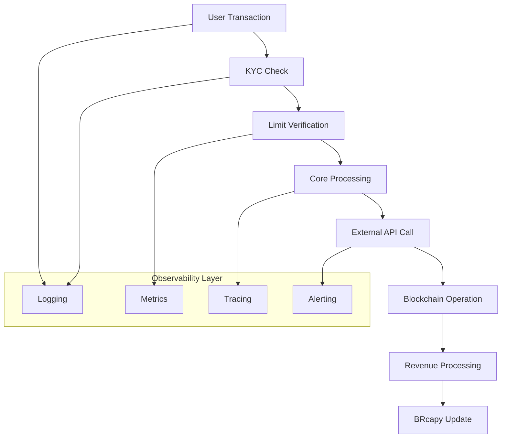

# 🔍 Arquitetura de Observabilidade - Capy Pay

## Visão Geral

A observabilidade no Capy Pay é **CRÍTICA** para garantir a confiabilidade, performance e segurança de um sistema financeiro. Nossa arquitetura implementa os **4 pilares da observabilidade moderna**:

1. **LOGS** - O que aconteceu e quando
2. **MÉTRICAS** - Quantos, quão rápido, quão grande  
3. **TRACES** - Como os componentes interagem
4. **ALERTAS** - Quando algo precisa de atenção

## 🎯 Por que Observabilidade é Crítica no Capy Pay?

### Requisitos de Sistema Financeiro
- **Confiança do Usuário**: 99.9%+ de disponibilidade
- **Compliance Regulatório**: Auditoria completa de operações
- **Detecção de Fraudes**: Identificação rápida de padrões suspeitos
- **Performance**: Latência baixa essencial para UX de pagamentos
- **Debugging Complexo**: Fluxos multi-serviço (KYC → Core → Blockchain → StarkBank)
- **Escalabilidade**: Monitoramento proativo para crescimento

### Fluxos Críticos Monitorados


## 🏗️ Arquitetura do Sistema

### Stack de Observabilidade

#### Desenvolvimento/MVP
```javascript
const observabilityStack = {
  logging: {
    library: 'winston',
    destinations: ['console', 'file'],
    format: 'structured_json',
    retention: '30_days'
  },
  
  metrics: {
    library: 'prometheus',
    collection: 'pull_based',
    scrape_interval: '15s',
    storage: 'in_memory'
  },
  
  tracing: {
    implementation: 'correlation_id',
    storage: 'logs',
    retention: '7_days'
  },
  
  alerting: {
    channels: ['console', 'slack'],
    thresholds: 'configurable'
  }
};
```

#### Produção Recomendada
```javascript
const productionStack = {
  logging: {
    centralized: 'AWS_CloudWatch | Google_Cloud_Logging | Datadog',
    aggregation: 'ELK_Stack | Grafana_Loki',
    retention: '7_years', // Compliance financeiro
    encryption: 'at_rest_and_transit'
  },
  
  metrics: {
    collection: 'Prometheus',
    visualization: 'Grafana',
    alerting: 'AlertManager',
    storage: 'VictoriaMetrics | Thanos'
  },
  
  tracing: {
    standard: 'OpenTelemetry',
    backend: 'Jaeger | Zipkin | Datadog_APM',
    sampling: 'intelligent',
    retention: '30_days'
  },
  
  alerting: {
    orchestration: 'PagerDuty | Opsgenie',
    channels: ['slack', 'email', 'sms', 'phone'],
    escalation: 'automated'
  }
};
```

## 📊 Sistema de Métricas

### Métricas de Negócio

#### Transações Financeiras
```javascript
const businessMetrics = {
  // Contadores de transações
  transactions_total: {
    type: 'counter',
    labels: ['type', 'status', 'user_kyc_level'],
    help: 'Total number of transactions'
  },
  
  // Volume financeiro
  transaction_volume_brl: {
    type: 'histogram',
    labels: ['type', 'status'],
    buckets: [1, 10, 50, 100, 500, 1000, 5000, 10000, 50000, 100000],
    help: 'Transaction volume in BRL'
  },
  
  // Usuários ativos
  active_users: {
    type: 'gauge',
    labels: ['period', 'kyc_level'],
    help: 'Number of active users'
  },
  
  // BRcapy
  brcapy_value: {
    type: 'gauge',
    help: 'Current BRcapy value in BRL'
  },
  
  brcapy_supply_total: {
    type: 'gauge', 
    help: 'Total BRcapy supply'
  }
};
```

#### Pool de Lastro
```javascript
const poolMetrics = {
  pool_value_brl: {
    type: 'gauge',
    labels: ['asset'],
    help: 'Pool total value in BRL'
  },
  
  pool_utilization_ratio: {
    type: 'gauge',
    help: 'Pool utilization ratio (0-1)'
  },
  
  pool_daily_revenue: {
    type: 'counter',
    help: 'Daily revenue processed'
  }
};
```

#### KYC/AML
```javascript
const kycMetrics = {
  kyc_verifications_total: {
    type: 'counter',
    labels: ['level', 'status', 'provider'],
    help: 'Total KYC verifications'
  },
  
  kyc_processing_duration: {
    type: 'histogram',
    labels: ['level', 'provider'],
    buckets: [1, 5, 10, 30, 60, 300, 1800], // seconds
    help: 'KYC processing duration'
  }
};
```

### Métricas de Sistema

#### Performance HTTP
```javascript
const systemMetrics = {
  http_request_duration_seconds: {
    type: 'histogram',
    labels: ['method', 'route', 'status_code'],
    buckets: [0.001, 0.005, 0.01, 0.05, 0.1, 0.5, 1, 2, 5, 10],
    help: 'Duration of HTTP requests'
  },
  
  http_requests_total: {
    type: 'counter',
    labels: ['method', 'route', 'status_code'],
    help: 'Total HTTP requests'
  }
};
```

#### APIs Externas
```javascript
const externalApiMetrics = {
  external_api_calls_total: {
    type: 'counter',
    labels: ['provider', 'endpoint', 'status'],
    help: 'External API calls'
  },
  
  external_api_duration_seconds: {
    type: 'histogram',
    labels: ['provider', 'endpoint'],
    buckets: [0.1, 0.5, 1, 2, 5, 10, 30, 60],
    help: 'External API call duration'
  }
};
```

#### Blockchain
```javascript
const blockchainMetrics = {
  blockchain_operations_total: {
    type: 'counter',
    labels: ['network', 'operation', 'status'],
    help: 'Blockchain operations'
  },
  
  blockchain_gas_used: {
    type: 'histogram',
    labels: ['network', 'operation'],
    help: 'Gas used in blockchain operations'
  }
};
```

## 📝 Sistema de Logging

### Estrutura de Logs

#### Log Estruturado (JSON)
```javascript
const logStructure = {
  timestamp: "2024-01-15T14:30:45.123Z",
  level: "INFO",
  message: "Transaction processed successfully",
  service: "capy-pay",
  environment: "production",
  version: "1.2.3",
  pid: 12345,
  hostname: "capy-pay-api-01",
  
  // Context
  correlationId: "capy_1705327845_a1b2c3d4",
  userId: "user_abc123",
  spanId: "span_def456",
  
  // Business Data
  transactionType: "crypto_swap",
  transactionAmount: 1500.50,
  fromToken: "USDC",
  toToken: "BRL",
  
  // Technical Data
  method: "POST",
  url: "/api/core/exchange/initiate",
  statusCode: 200,
  duration: 2340,
  
  // Additional Context
  userAgent: "Mozilla/5.0...",
  ip: "192.168.1.100",
  kycLevel: "LEVEL_2"
};
```

#### Níveis de Log
```javascript
const logLevels = {
  ERROR: {
    use: 'System errors, failed transactions, API failures',
    retention: '7_years', // Compliance
    alerting: true,
    examples: ['Payment failed', 'KYC verification error', 'External API timeout']
  },
  
  WARN: {
    use: 'Degraded performance, high resource usage, suspicious activity',
    retention: '1_year',
    alerting: 'conditional',
    examples: ['High memory usage', 'Slow API response', 'Unusual transaction pattern']
  },
  
  INFO: {
    use: 'Normal business operations, successful transactions',
    retention: '90_days',
    alerting: false,
    examples: ['Transaction completed', 'User logged in', 'KYC approved']
  },
  
  DEBUG: {
    use: 'Detailed technical information for troubleshooting',
    retention: '7_days',
    alerting: false,
    examples: ['API request/response', 'Database queries', 'Internal calculations']
  }
};
```

### Configuração de Logging por Ambiente

#### Desenvolvimento
```javascript
const developmentLogging = {
  level: 'DEBUG',
  destinations: ['console'],
  format: 'human_readable',
  colors: true,
  prettyPrint: true
};
```

#### Produção
```javascript
const productionLogging = {
  level: 'INFO',
  destinations: ['file', 'cloudwatch'],
  format: 'json',
  encryption: 'AES-256',
  compression: 'gzip',
  rotation: 'daily',
  maxSize: '100MB',
  maxFiles: 30
};
```

## 🔗 Rastreamento Distribuído

### Correlation ID Strategy

#### Geração de Correlation ID
```javascript
const generateCorrelationId = () => {
  return `capy_${Date.now()}_${uuidv4().substring(0, 8)}`;
};

// Exemplo: capy_1705327845123_a1b2c3d4
```

#### Propagação entre Serviços
```javascript
const propagateCorrelationId = {
  // HTTP Headers
  incomingHeader: 'X-Correlation-ID',
  outgoingHeader: 'X-Correlation-ID',
  
  // Adicionar a todas as chamadas externas
  externalApiCalls: {
    starkbank: { header: 'X-Request-ID' },
    oneInch: { header: 'X-Correlation-ID' },
    blockchain: { header: 'X-Trace-ID' }
  },
  
  // Incluir em todos os logs
  logging: {
    field: 'correlationId',
    mandatory: true
  }
};
```

### Span Structure (Futuro OpenTelemetry)
```javascript
const spanStructure = {
  spanId: 'span_abc123',
  traceId: 'trace_def456', 
  parentSpanId: 'span_parent789',
  operationName: 'crypto_swap_execution',
  startTime: 1705327845123,
  endTime: 1705327847463,
  duration: 2340, // milliseconds
  
  tags: {
    'http.method': 'POST',
    'http.url': '/api/core/exchange/initiate',
    'http.status_code': 200,
    'swap.from_token': 'USDC',
    'swap.to_token': 'BRL',
    'swap.amount': 1500.50,
    'user.id': 'user_abc123',
    'user.kyc_level': 'LEVEL_2'
  },
  
  logs: [
    {
      timestamp: 1705327845200,
      message: 'Fetching quote from 1inch',
      data: { slippage: 0.5 }
    },
    {
      timestamp: 1705327845800,
      message: 'Quote received',
      data: { estimatedOutput: 7752.60 }
    },
    {
      timestamp: 1705327847400,
      message: 'Swap executed successfully',
      data: { transactionHash: '0xabc123...' }
    }
  ]
};
```

## 🚨 Sistema de Alertas

### Categorias de Alertas

#### Críticos (CRITICAL)
```javascript
const criticalAlerts = {
  triggers: [
    'System down (health check failed)',
    'Database connection lost',
    'Critical external API failure (StarkBank)',
    'Security breach detected',
    'Financial discrepancy detected'
  ],
  
  response: {
    channels: ['pagerduty', 'phone', 'slack', 'email'],
    escalation: 'immediate',
    sla: '5_minutes'
  },
  
  examples: {
    system_down: {
      title: '🔴 CRITICAL: Capy Pay System Down',
      message: 'Health check failed - system unresponsive',
      severity: 'critical',
      runbook: 'https://docs.capypay.com/runbooks/system-down'
    }
  }
};
```

#### Alto (HIGH)
```javascript
const highAlerts = {
  triggers: [
    'High error rate (>5%)',
    'External API degraded',
    'High memory/CPU usage (>85%)',
    'Unusual transaction patterns',
    'KYC verification failures spike'
  ],
  
  response: {
    channels: ['slack', 'email'],
    escalation: '15_minutes',
    sla: '15_minutes'
  }
};
```

#### Médio (MEDIUM)
```javascript
const mediumAlerts = {
  triggers: [
    'Moderate error rate (1-5%)',
    'Slow API responses (>2s)',
    'Pool utilization high (>80%)',
    'BRcapy value anomaly',
    'Increased support tickets'
  ],
  
  response: {
    channels: ['slack'],
    escalation: '1_hour',
    sla: '1_hour'
  }
};
```

### Configuração de Canais

#### Slack Integration
```javascript
const slackConfig = {
  webhook: process.env.SLACK_WEBHOOK_URL,
  channels: {
    critical: '#alerts-critical',
    high: '#alerts-high', 
    medium: '#alerts-medium',
    financial: '#alerts-financial'
  },
  
  messageFormat: {
    title: '🚨 Alert Title',
    color: 'danger', // good, warning, danger
    fields: [
      { title: 'Severity', value: 'CRITICAL', short: true },
      { title: 'Service', value: 'capy-pay', short: true },
      { title: 'Environment', value: 'production', short: true },
      { title: 'Correlation ID', value: 'capy_123', short: true }
    ],
    actions: [
      { text: 'View Logs', url: 'https://grafana.capypay.com' },
      { text: 'Runbook', url: 'https://docs.capypay.com/runbooks' }
    ]
  }
};
```

#### PagerDuty Integration
```javascript
const pagerDutyConfig = {
  integrationKey: process.env.PAGERDUTY_INTEGRATION_KEY,
  
  escalationPolicy: {
    critical: {
      level1: 'on_call_engineer',
      level2: 'senior_engineer', 
      level3: 'engineering_manager',
      timeout: '5_minutes_per_level'
    }
  },
  
  services: {
    capy_pay_api: 'service_key_api',
    capy_pay_financial: 'service_key_financial',
    capy_pay_infrastructure: 'service_key_infra'
  }
};
```

## 📊 Dashboards de Observabilidade

### Dashboard Principal - System Overview

#### Painéis Implementados
```javascript
const systemOverviewPanels = [
  {
    title: '🎯 Key Business Metrics',
    type: 'stat',
    metrics: [
      'capypay_transactions_total (1h)',
      'capypay_transaction_volume_brl',
      'capypay_active_users',
      'capypay_brcapy_value'
    ]
  },
  
  {
    title: '📊 Transaction Volume by Type',
    type: 'timeseries',
    metric: 'sum by (type) (rate(capypay_transactions_total[5m]))'
  },
  
  {
    title: '💰 BRcapy Performance', 
    type: 'timeseries',
    metrics: [
      'capypay_brcapy_value',
      'capypay_brcapy_supply_total'
    ]
  },
  
  {
    title: '🏦 Pool Health',
    type: 'gauge',
    metric: 'capypay_pool_utilization_ratio * 100',
    thresholds: { green: '<70%', yellow: '70-90%', red: '>90%' }
  }
];
```

### Dashboard Financeiro - Financial Operations

#### Painéis Específicos
```javascript
const financialDashboardPanels = [
  {
    title: '💰 Financial Overview',
    metrics: [
      'Total Volume (24h)',
      'Total Transactions (24h)', 
      'Average Transaction Value',
      'Pool Value (BRL)'
    ]
  },
  
  {
    title: '🎯 Transaction Success Rate',
    type: 'gauge',
    metric: 'success_rate_percentage',
    sla: '>99%'
  },
  
  {
    title: '🐹 BRcapy Metrics',
    type: 'timeseries',
    metrics: ['value', 'supply', 'apy']
  },
  
  {
    title: '⛓️ Blockchain Operations',
    type: 'timeseries',
    metric: 'blockchain_operations by network and status'
  }
];
```

### Dashboard de Alertas - Alert Management

#### Visão de Alertas
```javascript
const alertDashboard = {
  panels: [
    {
      title: '🚨 Active Alerts',
      type: 'table',
      data: 'current_active_alerts',
      columns: ['Severity', 'Service', 'Message', 'Duration', 'Actions']
    },
    
    {
      title: '📈 Alert Frequency',
      type: 'timeseries',
      metric: 'alerts_fired_total by severity'
    },
    
    {
      title: '⏱️ Mean Time to Resolution',
      type: 'stat',
      metric: 'avg_resolution_time by severity'
    }
  ]
};
```

## 🔧 Implementação Técnica

### Exemplo de Uso - Transação Completa

#### 1. Início da Request
```javascript
// Middleware de observabilidade
app.use(observabilityMiddleware());

router.post('/api/core/exchange/initiate', (req, res) => {
  // Correlation ID automaticamente gerado
  // Span criado automaticamente
  // Métricas de HTTP iniciadas
  
  const logger = createLogger(req.correlationId, 'core-exchange');
  logger.info('Crypto swap initiated', {
    fromToken: req.body.fromToken,
    toToken: req.body.toToken,
    amount: req.body.amount,
    userId: req.user?.id
  });
});
```

#### 2. Chamada Externa com Rastreamento
```javascript
const quoteResult = await withExternalApiTracking('1inch', '/quote')(async () => {
  const response = await axios.get('https://api.1inch.io/v5.0/1/quote', {
    headers: {
      'X-Correlation-ID': req.correlationId
    },
    params: { /* quote params */ }
  });
  
  return response.data;
});

// Métricas automaticamente coletadas:
// - capypay_external_api_calls_total{provider="1inch",endpoint="/quote",status="success"}
// - capypay_external_api_duration_seconds{provider="1inch",endpoint="/quote"}
```

#### 3. Operação Blockchain
```javascript
const swapResult = await withBlockchainTracking('ethereum', 'swap')(async () => {
  const tx = await ethers.contract.swap({
    fromToken,
    toToken,
    amount
  });
  
  return await tx.wait();
});

// Métricas automaticamente coletadas:
// - capypay_blockchain_operations_total{network="ethereum",operation="swap",status="success"}
```

#### 4. Finalização com Métricas
```javascript
// Middleware automaticamente coleta:
// - capypay_http_request_duration_seconds{method="POST",route="/exchange/initiate",status_code="200"}
// - capypay_http_requests_total{method="POST",route="/exchange/initiate",status_code="200"}
// - capypay_transactions_total{type="crypto_swap",status="success",user_kyc_level="LEVEL_2"}
```

### Exemplo de Log Completo
```json
{
  "timestamp": "2024-01-15T14:30:45.123Z",
  "level": "INFO",
  "message": "Crypto swap completed successfully",
  "service": "capy-pay",
  "environment": "production",
  "correlationId": "capy_1705327845123_a1b2c3d4",
  "spanId": "span_abc123",
  "userId": "user_def456",
  "transactionType": "crypto_swap",
  "fromToken": "USDC",
  "toToken": "BRL", 
  "inputAmount": 1500.50,
  "outputAmount": 7752.60,
  "transactionHash": "0xabc123def456...",
  "gasUsed": "150000",
  "duration": 2340,
  "externalApiCalls": [
    {"provider": "1inch", "endpoint": "/quote", "duration": 200},
    {"provider": "1inch", "endpoint": "/swap", "duration": 1800}
  ],
  "method": "POST",
  "url": "/api/core/exchange/initiate",
  "statusCode": 200,
  "userAgent": "CapyPay-MiniApp/1.0",
  "ip": "192.168.1.100"
}
```

## 🚀 Deployment e Configuração

### Variáveis de Ambiente

#### Logging
```bash
# Logging Configuration
LOG_LEVEL=info
CLOUD_LOGGING_ENABLED=true
AWS_CLOUDWATCH_GROUP=capy-pay-logs
DATADOG_API_KEY=your_datadog_key
```

#### Métricas
```bash
# Metrics Configuration
METRICS_PORT=9090
PROMETHEUS_SCRAPE_INTERVAL=15s
GRAFANA_URL=https://grafana.capypay.com
```

#### Alertas
```bash
# Alerting Configuration
SLACK_WEBHOOK_URL=https://hooks.slack.com/services/...
PAGERDUTY_INTEGRATION_KEY=your_pagerduty_key
ALERT_EMAIL=alerts@capypay.com
```

### Docker Compose para Desenvolvimento
```yaml
version: '3.8'
services:
  capy-pay-api:
    build: .
    environment:
      - LOG_LEVEL=debug
      - METRICS_PORT=9090
    ports:
      - "3001:3001"
      - "9090:9090"
    volumes:
      - ./logs:/app/logs

  prometheus:
    image: prom/prometheus
    ports:
      - "9091:9090"
    volumes:
      - ./observability/prometheus.yml:/etc/prometheus/prometheus.yml
    command:
      - '--config.file=/etc/prometheus/prometheus.yml'
      - '--storage.tsdb.path=/prometheus'

  grafana:
    image: grafana/grafana
    ports:
      - "3000:3000"
    environment:
      - GF_SECURITY_ADMIN_PASSWORD=admin
    volumes:
      - ./observability/dashboards:/var/lib/grafana/dashboards
```

### Prometheus Configuration
```yaml
# observability/prometheus.yml
global:
  scrape_interval: 15s

scrape_configs:
  - job_name: 'capy-pay'
    static_configs:
      - targets: ['capy-pay-api:9090']
    metrics_path: '/metrics'
    scrape_interval: 15s

rule_files:
  - "alert_rules.yml"

alerting:
  alertmanagers:
    - static_configs:
        - targets:
          - alertmanager:9093
```

## 📈 Métricas de Sucesso

### SLIs (Service Level Indicators)
```javascript
const slis = {
  availability: {
    target: '99.9%',
    measurement: 'successful_requests / total_requests'
  },
  
  latency: {
    target: '95% < 2s',
    measurement: 'histogram_quantile(0.95, http_request_duration)'
  },
  
  error_rate: {
    target: '<1%',
    measurement: 'error_requests / total_requests'
  },
  
  throughput: {
    target: '1000 RPS',
    measurement: 'rate(http_requests_total[1m])'
  }
};
```

### SLOs (Service Level Objectives)
```javascript
const slos = {
  monthly_availability: '99.9%',
  p95_latency: '2_seconds',
  error_budget: '0.1%',
  mttr: '15_minutes' // Mean Time to Recovery
};
```

## 🔍 Troubleshooting Guide

### Fluxo de Debug
1. **Identificar o Problema**
   - Verificar dashboards para anomalias
   - Consultar alertas ativos
   - Analisar métricas de erro

2. **Localizar Logs Relacionados**
   ```bash
   # Buscar por correlation ID
   grep "capy_1705327845123_a1b2c3d4" /app/logs/app.log
   
   # Filtrar por serviço e timeframe
   grep -A 10 -B 10 "ERROR.*core-exchange" /app/logs/app.log
   ```

3. **Rastrear Request Completa**
   - Usar correlation ID para seguir request através de todos os serviços
   - Identificar onde o problema ocorreu
   - Verificar chamadas externas

4. **Analisar Métricas**
   - Verificar latência de APIs externas
   - Checar utilização de recursos
   - Comparar com baseline histórico

### Comandos Úteis

#### Logs
```bash
# Tail logs em tempo real
tail -f logs/app.log | jq '.'

# Filtrar por nível de erro
grep '"level":"ERROR"' logs/app.log | jq '.'

# Buscar transações específicas
grep '"transactionType":"crypto_swap"' logs/app.log | jq '.'
```

#### Métricas
```bash
# Verificar métricas expostas
curl http://localhost:9090/metrics

# Query específica no Prometheus
curl 'http://prometheus:9091/api/v1/query?query=capypay_transactions_total'
```

---

## 🎯 Conclusão

A arquitetura de observabilidade do Capy Pay fornece:

✅ **Visibilidade Completa** - Logs, métricas, traces e alertas integrados  
✅ **Detecção Proativa** - Alertas automáticos para problemas críticos  
✅ **Debug Eficiente** - Correlation IDs e tracing distribuído  
✅ **Compliance** - Logs auditáveis por 7 anos  
✅ **Escalabilidade** - Arquitetura preparada para crescimento  
✅ **Experiência DevOps** - Dashboards intuitivos e runbooks  

### 🚀 **O sistema está pronto para monitoramento de produção com observabilidade de classe mundial!**

---

**📋 Este documento deve ser revisado mensalmente e atualizado conforme evolução da arquitetura e novas ferramentas de observabilidade.** 