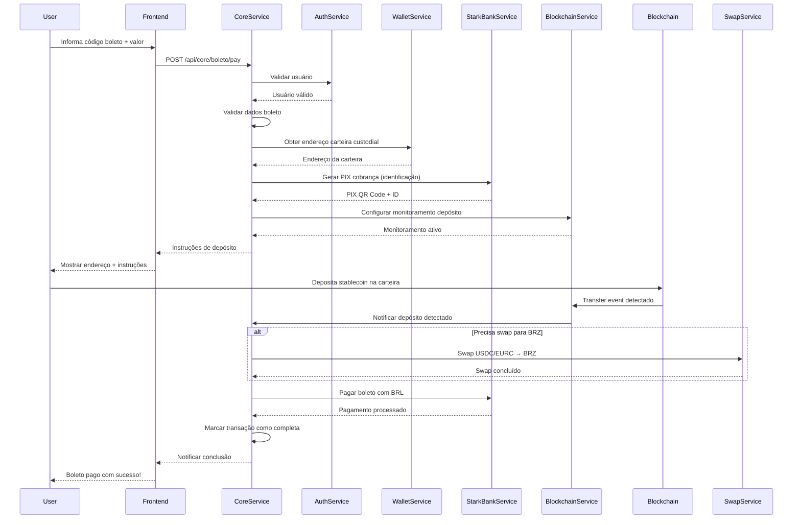
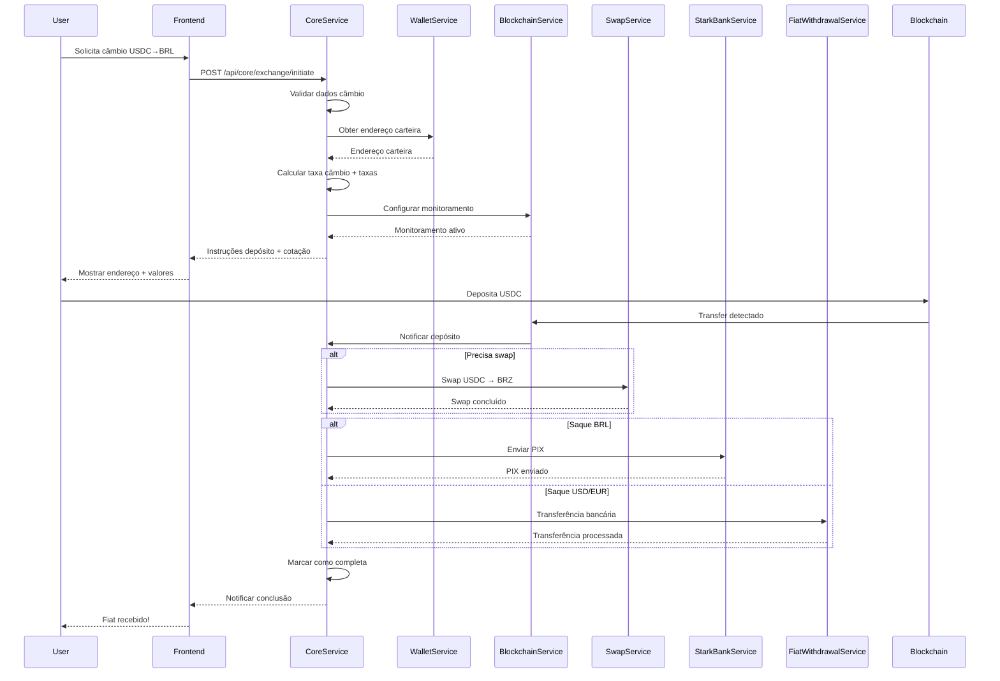

# 🎼 Fluxos de Orquestração - Capy Pay CoreService

Documentação completa dos fluxos de negócio orquestrados pelo CoreService, que coordena todas as operações entre microsserviços.

## 🏗️ Arquitetura de Orquestração

### Princípios Fundamentais
- **Event-Driven Architecture**: Comunicação assíncrona entre serviços
- **State Machine Pattern**: Estados bem definidos para cada transação
- **Idempotency**: Operações podem ser repetidas com segurança
- **Circuit Breaker**: Proteção contra cascata de falhas
- **Compensation Patterns**: Rollback automático em caso de erro

### Componentes do CoreService
```
┌─────────────────────────────────────────────────────────────┐
│                      CoreService                            │
├─────────────────────────────────────────────────────────────┤
│  ┌─────────────────┐  ┌─────────────────┐  ┌─────────────── │
│  │ Transaction     │  │ State Machine   │  │ Error Handler  │
│  │ Manager         │  │ Controller      │  │ & Recovery     │
│  └─────────────────┘  └─────────────────┘  └─────────────── │
├─────────────────────────────────────────────────────────────┤
│                   Service Orchestration                     │
├─────────────────────────────────────────────────────────────┤
│ AuthService │ WalletService │ StarkBankService │ SwapService │
└─────────────────────────────────────────────────────────────┘
```

## 💳 FLUXO 1: Pagamento de Boleto com Cripto

### Visão Geral
Usuário deposita stablecoin na carteira custodial do Capy Pay, que usa seus próprios recursos fiat para pagar o boleto, enquanto a stablecoin vai para pool de rendimento.

### Sequência Completa



### Estados da Transação

| Estado | Descrição | Próximo Estado |
|--------|-----------|----------------|
| `INITIATED` | Transação criada, aguardando depósito | `IN_PROGRESS` |
| `IN_PROGRESS` | Depósito detectado, processando pagamento | `COMPLETED` ou `FAILED` |
| `COMPLETED` | Boleto pago com sucesso | - |
| `FAILED` | Erro em qualquer etapa | - |
| `EXPIRED` | Timeout sem depósito | - |

### Steps Detalhados

#### 1. **Iniciação (POST /api/core/boleto/pay)**
```javascript
{
  "barcode": "34191790010104351004791020150008291070026000",
  "amount": 150.50,
  "dueDate": "2024-01-15T23:59:59Z",
  "recipient": "Empresa XYZ"
}
```

**Validações:**
- Código de barras válido (44-48 dígitos)
- Valor positivo
- Data de vencimento futura
- Usuário autenticado e ativo

#### 2. **Setup da Carteira**
```javascript
// CoreService obtém endereço custodial
const walletAddress = await walletService.getWalletAddress(userId);

// Atualiza estado da transação
await updateTransactionStep(transactionId, 'walletSetup', 'COMPLETED', {
  walletAddress: '0x742d35Cc6634C0532925a3b8D4b9F5a8e3F1c4A7'
});
```

#### 3. **Geração PIX Identificação**
```javascript
// PIX para identificar a transação (não é usado para pagamento direto)
const pixData = await starkBankService.generatePixQrCode({
  amount: boletoAmount,
  description: `Boleto payment - ${transactionId}`,
  expiration: 30 * 60, // 30 minutos
  tags: [`boleto:${transactionId}`, `user:${userId}`]
});
```

#### 4. **Monitoramento de Depósito**
```javascript
await blockchainService.addDepositWatch({
  transactionId,
  userWalletAddress: walletAddress,
  expectedAmount: boletoAmount,
  tokenTypes: ['USDC', 'BRZ', 'EURC'],
  timeout: 30 * 60 * 1000 // 30 minutos
});
```

#### 5. **Processamento Após Depósito**
```javascript
async processBoletoAfterDeposit(transactionId, depositData) {
  // 1. Swap se necessário
  if (depositData.token !== 'BRZ') {
    const swapResult = await swapService.executeSwap({
      fromToken: depositData.token,
      toToken: 'BRZ',
      amount: depositData.amount,
      slippage: 0.5
    });
  }
  
  // 2. Pagar boleto
  const paymentResult = await starkBankService.payBill({
    barcode: boletoData.barcode,
    amount: boletoData.amount,
    description: `Capy Pay - ${transactionId}`
  });
  
  // 3. Finalizar transação
  await completeTransaction(transactionId, 'Boleto paid successfully');
}
```

## 💱 FLUXO 2: Câmbio (Stablecoin para Fiat)

### Visão Geral
Usuário deposita stablecoin e recebe fiat via PIX (BRL) ou transferência bancária (USD/EUR).

### Sequência Completa



### Tipos de Câmbio Suportados

| Origem | Destino | Método Saque | Swap Necessário |
|--------|---------|--------------|-----------------|
| USDC | BRL | PIX | USDC → BRZ |
| EURC | BRL | PIX | EURC → BRZ |
| BRZ | BRL | PIX | Não |
| USDC | USD | Bank Transfer | Não |
| EURC | EUR | Bank Transfer | Não |
| BRZ | EUR | Bank Transfer | BRZ → EURC |

### Steps Detalhados

#### 1. **Iniciação (POST /api/core/exchange/initiate)**
```javascript
{
  "fromToken": "USDC",
  "toFiat": "BRL",
  "amount": 1000.0,
  "withdrawalMethod": "PIX",
  "withdrawalData": {
    "pixKey": "user@example.com"
  }
}
```

#### 2. **Cálculo de Cotação**
```javascript
const exchangeRate = await calculateExchangeRate('USDC', 'BRL');
// Rate: 5.2 BRL per USDC

const fees = calculateFees(1000.0, 'EXCHANGE');
// Fee: 0.5% = 5.0 USDC

const fiatAmount = 1000.0 * 5.2; // 5200 BRL
const netAmount = fiatAmount - (fees.total * 5.2); // 5174 BRL
```

#### 3. **Processamento Após Depósito**
```javascript
async processExchangeAfterDeposit(transactionId, depositData) {
  const exchangeData = transaction.data.exchange;
  
  // 1. Swap se necessário
  if (needsSwapForFiat(depositData.token, exchangeData.toFiat)) {
    const targetToken = getTargetTokenForFiat(exchangeData.toFiat);
    const swapResult = await swapService.executeSwap({
      fromToken: depositData.token,
      toToken: targetToken,
      amount: depositData.amount
    });
  }
  
  // 2. Executar saque
  if (exchangeData.toFiat === 'BRL') {
    // PIX via StarkBank
    const pixResult = await starkBankService.sendPix({
      amount: finalAmount,
      pixKey: exchangeData.withdrawalData.pixKey,
      description: `Capy Pay Exchange - ${transactionId}`
    });
  } else {
    // USD/EUR via FiatWithdrawalService
    const withdrawalResult = await executeFiatWithdrawal({
      amount: finalAmount,
      currency: exchangeData.toFiat,
      withdrawalData: exchangeData.withdrawalData
    });
  }
}
```

## 🔄 Gestão de Estados e Erros

### State Machine Pattern

```javascript
const transactionStates = {
  'INITIATED': ['IN_PROGRESS', 'FAILED', 'EXPIRED'],
  'IN_PROGRESS': ['COMPLETED', 'FAILED'],
  'COMPLETED': [], // Estado final
  'FAILED': [], // Estado final
  'EXPIRED': [] // Estado final
};
```

### Tratamento de Erros por Etapa

#### 1. **Erro na Validação**
```javascript
// Falha imediata, sem cleanup necessário
await failTransaction(transactionId, 'Invalid boleto barcode');
```

#### 2. **Erro no Depósito (Timeout)**
```javascript
// Timeout de 30 minutos
setTimeout(async () => {
  const transaction = getTransaction(transactionId);
  if (transaction.status === 'INITIATED') {
    await failTransaction(transactionId, 'Deposit timeout - no funds received');
  }
}, 30 * 60 * 1000);
```

#### 3. **Erro no Swap**
```javascript
try {
  const swapResult = await swapService.executeSwap(swapParams);
} catch (error) {
  // Tentar novamente até 3 vezes
  if (retryCount < 3) {
    await retrySwap(transactionId, swapParams, retryCount + 1);
  } else {
    // Compensation: devolver tokens para usuário
    await compensateFailedSwap(transactionId, depositData);
    await failTransaction(transactionId, `Swap failed: ${error.message}`);
  }
}
```

#### 4. **Erro no Pagamento**
```javascript
try {
  const paymentResult = await starkBankService.payBill(boletoData);
} catch (error) {
  // Compensation: manter stablecoin na conta do usuário
  await compensateFailedPayment(transactionId, depositData);
  await failTransaction(transactionId, `Payment failed: ${error.message}`);
}
```

### Compensation Patterns

#### Rollback de Swap
```javascript
async compensateFailedSwap(transactionId, originalDeposit) {
  logger.info('Compensating failed swap', { transactionId });
  
  // Creditar tokens originais de volta ao usuário
  await walletService.creditTokens(
    originalDeposit.userAddress,
    originalDeposit.token,
    originalDeposit.amount
  );
  
  // Registrar compensação
  await updateTransactionStep(transactionId, 'compensation', 'COMPLETED', {
    type: 'swap_rollback',
    creditedAmount: originalDeposit.amount,
    creditedToken: originalDeposit.token
  });
}
```

#### Rollback de Pagamento
```javascript
async compensateFailedPayment(transactionId, swapResult) {
  logger.info('Compensating failed payment', { transactionId });
  
  // Manter BRZ na conta do usuário como crédito
  await creditUserAccount(transaction.userId, swapResult.outputAmount, 'BRZ');
  
  // Notificar usuário sobre crédito disponível
  await notifyUserCredit(transaction.userId, {
    amount: swapResult.outputAmount,
    currency: 'BRZ',
    reason: 'Failed boleto payment compensation'
  });
}
```

## 📊 Monitoramento e Observabilidade

### Métricas Importantes

#### Transaction Metrics
```javascript
const metrics = {
  // Volume
  totalTransactions: 1250,
  completedTransactions: 1180,
  failedTransactions: 45,
  expiredTransactions: 25,
  
  // Por tipo
  boletoPayments: 800,
  exchangeOperations: 450,
  
  // Performance
  avgCompletionTime: '4.5 minutes',
  avgDepositDetectionTime: '30 seconds',
  swapSuccessRate: 98.2,
  paymentSuccessRate: 94.4,
  
  // Financeiro
  totalVolume: '2.5M BRL',
  totalFees: '12.5K BRL',
  
  // Erros
  mostCommonErrors: [
    'Deposit timeout',
    'Insufficient swap liquidity',
    'Boleto payment rejected'
  ]
};
```

#### Real-time Monitoring
```javascript
// Alertas automáticos
const alerts = {
  highFailureRate: 'Failure rate > 5% in last hour',
  lowLiquidity: 'Swap liquidity < threshold',
  depositDelays: 'Avg deposit detection > 2 minutes',
  paymentIssues: 'Multiple payment failures detected'
};
```

### Logs Estruturados

```javascript
// Log de início de transação
logger.info('Transaction initiated', {
  transactionId: 'tx_123',
  type: 'BOLETO_PAYMENT',
  userId: 'user_456',
  amount: 150.50,
  currency: 'BRL',
  metadata: {
    barcode: '34191790010104...',
    userAgent: 'MiniKit/1.0',
    ip: '192.168.1.1'
  }
});

// Log de mudança de estado
logger.info('Transaction state changed', {
  transactionId: 'tx_123',
  fromState: 'INITIATED',
  toState: 'IN_PROGRESS',
  trigger: 'deposit_detected',
  depositData: {
    amount: 150.50,
    token: 'USDC',
    txHash: '0xabc123...'
  }
});

// Log de erro com contexto
logger.error('Transaction failed', {
  transactionId: 'tx_123',
  error: 'Swap execution failed',
  errorCode: 'INSUFFICIENT_LIQUIDITY',
  retryCount: 3,
  compensationApplied: true,
  context: {
    swapParams: { from: 'USDC', to: 'BRZ', amount: 150.50 },
    liquidityData: { available: 100.0, required: 150.50 }
  }
});
```

## 🚀 Extensibilidade e Futuras Implementações

### FiatWithdrawalService (Placeholder)

```javascript
class FiatWithdrawalService {
  constructor() {
    this.providers = {
      USD: new USBankProvider(),
      EUR: new EURBankProvider(),
      GBP: new UKBankProvider()
    };
  }
  
  async executeWithdrawal(withdrawalData) {
    const { amount, currency, bankAccount, transactionId } = withdrawalData;
    
    const provider = this.providers[currency];
    if (!provider) {
      throw new Error(`Unsupported currency: ${currency}`);
    }
    
    // Validar dados bancários
    await provider.validateBankAccount(bankAccount);
    
    // Executar transferência
    const result = await provider.sendTransfer({
      amount,
      destination: bankAccount,
      reference: `CAPY-${transactionId}`,
      description: 'Capy Pay withdrawal'
    });
    
    return {
      success: true,
      withdrawalId: result.id,
      estimatedArrival: result.estimatedArrival,
      fees: result.fees
    };
  }
}
```

### Novos Tipos de Transação

```javascript
// Futura expansão para outros fluxos
const transactionTypes = {
  'BOLETO_PAYMENT': 'Pagamento de boleto com cripto',
  'CRYPTO_FIAT_EXCHANGE': 'Câmbio cripto para fiat',
  'P2P_TRANSFER': 'Transferência P2P entre usuários',
  'RECURRING_PAYMENT': 'Pagamento recorrente',
  'CRYPTO_PURCHASE': 'Compra de cripto com fiat',
  'YIELD_FARMING': 'Aplicação em yield farming',
  'NFT_PURCHASE': 'Compra de NFT'
};
```

### Integração com Outros Blockchains

```javascript
// Suporte multi-chain futuro
const supportedNetworks = {
  base: {
    chainId: 8453,
    tokens: ['USDC', 'BRZ', 'EURC'],
    monitor: BaseMonitorService
  },
  polygon: {
    chainId: 137,
    tokens: ['USDC', 'USDT', 'DAI'],
    monitor: PolygonMonitorService
  },
  arbitrum: {
    chainId: 42161,
    tokens: ['USDC', 'USDT', 'ARB'],
    monitor: ArbitrumMonitorService
  }
};
```

## 📋 Resumo dos Fluxos

### Fluxo de Boleto
1. **Input**: Código de barras + valor
2. **Setup**: Validação + carteira custodial + PIX identificação
3. **Depósito**: Usuário deposita stablecoin
4. **Processamento**: Swap (se necessário) + pagamento boleto
5. **Output**: Boleto pago + confirmação

### Fluxo de Câmbio
1. **Input**: Token origem + fiat destino + dados saque
2. **Setup**: Validação + cotação + carteira custodial
3. **Depósito**: Usuário deposita stablecoin
4. **Processamento**: Swap (se necessário) + saque fiat
5. **Output**: Fiat enviado + confirmação

### Características Comuns
- **Timeouts**: 30 minutos para depósito
- **Retries**: Até 3 tentativas para operações
- **Compensation**: Rollback automático em falhas
- **Monitoring**: Logs completos + métricas
- **Security**: Validação rigorosa + auditoria

---

## 🎼 **O CoreService é o maestro que orquestra toda a sinfonia do Capy Pay!**

Cada microsserviço toca sua parte perfeitamente, coordenados pelo CoreService para criar uma experiência fluida e confiável para os usuários. 