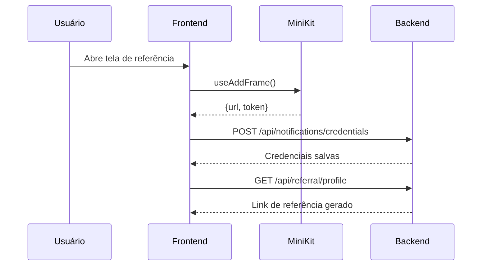
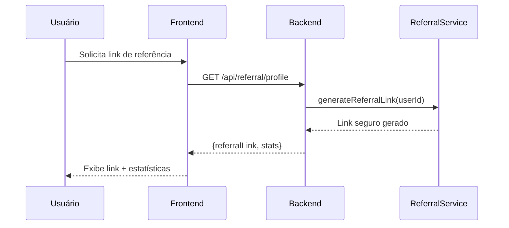
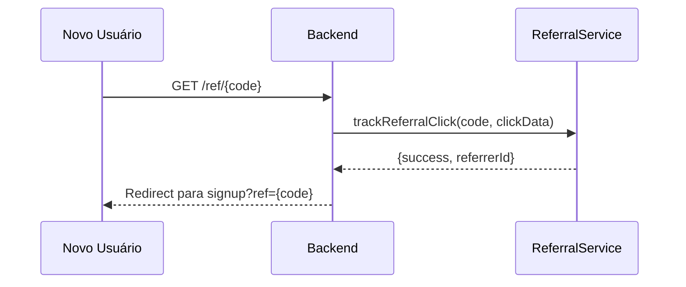
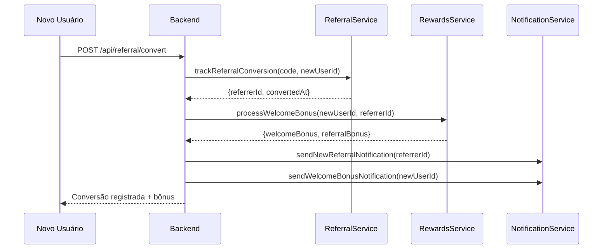
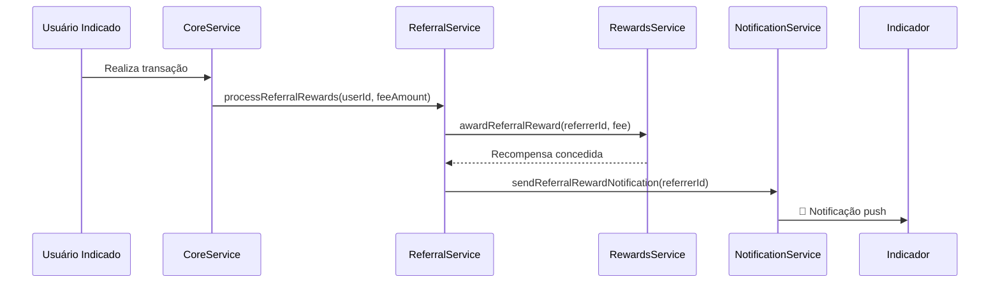

# 🐹 Sistema de Referência e Notificações - Capy Pay

## Visão Geral

O sistema de referência e notificações do Capy Pay permite que usuários indiquem amigos e ganhem recompensas em Capy Coins baseadas nas transações dos indicados. O sistema utiliza o MiniKit para notificações push nativas.

## 📋 Arquitetura do Sistema

### Componentes Principais

#### Frontend (MiniApp)
- **ReferralScreen**: Interface de gerenciamento de referência
- **NotificationManager**: Gerenciamento de notificações MiniKit
- **Integração MiniKit**: `useNotification`, `useAddFrame`

#### Backend (Node.js)
- **ReferralService**: Geração e rastreamento de links
- **RewardsService**: Distribuição de recompensas
- **NotificationService**: Envio de notificações push
- **APIs REST**: Endpoints para todas as operações

## 🔄 Fluxo de Ponta a Ponta

### 1. Configuração Inicial do Usuário



#### Código Frontend (NotificationManager)
```typescript
// Salvar credenciais quando frame é adicionado
useEffect(() => {
  if (isFrameAdded && context?.client?.url && context?.client?.token) {
    saveNotificationCredentials(context.client.url, context.client.token);
  }
}, [isFrameAdded, context?.client]);

const saveNotificationCredentials = async (url: string, token: string) => {
  await fetch('/api/notifications/credentials', {
    method: 'POST',
    headers: {
      'Authorization': `Bearer ${accessToken}`,
      'Content-Type': 'application/json',
    },
    body: JSON.stringify({
      userId,
      notificationUrl: url,
      notificationToken: token,
      isFrameAdded: true
    }),
  });
};
```

#### Código Backend (NotificationService)
```javascript
async saveUserCredentials(userId, url, token) {
  // Validar formato da URL
  if (!this.isValidNotificationUrl(url)) {
    return { success: false, error: 'Invalid notification URL format' };
  }

  // Salvar credenciais
  this.userCredentials.set(userId, {
    url,
    token,
    isActive: true,
    createdAt: new Date().toISOString()
  });

  return { success: true };
}
```

### 2. Geração de Link de Referência



#### Código Backend (ReferralService)
```javascript
async generateReferralLink(userId) {
  // Gerar código seguro
  const referralCode = this.generateSecureCode(userId);
  const fullLink = `${this.baseUrl}/ref/${referralCode}`;

  // Armazenar link e rastreamento
  this.referralLinks.set(userId, {
    code: referralCode,
    createdAt: new Date().toISOString(),
    clicks: 0,
    conversions: 0
  });

  this.referralTracking.set(referralCode, {
    referrerId: userId,
    createdAt: new Date().toISOString()
  });

  return {
    success: true,
    referralLink: fullLink,
    referralCode
  };
}

generateSecureCode(userId) {
  const timestamp = Date.now().toString();
  const random = crypto.randomBytes(8).toString('hex');
  const hash = crypto.createHash('sha256')
    .update(userId + timestamp + random)
    .digest('hex');
  
  return hash.substring(0, 12); // Código de 12 caracteres
}
```

### 3. Clique e Rastreamento de Link



#### Código Backend (Rota)
```javascript
router.get('/click/:code', async (req, res) => {
  const referralCode = req.params.code;
  const clickData = {
    ip: req.ip,
    userAgent: req.get('User-Agent'),
    referer: req.get('Referer')
  };

  const result = await referralService.trackReferralClick(referralCode, clickData);

  if (!result.success) {
    return res.redirect('https://capypay.app?error=invalid_referral');
  }

  // Redirecionar para página de registro
  res.redirect(`https://capypay.app/signup?ref=${referralCode}`);
});
```

### 4. Conversão de Referência (Registro)



#### Código Backend (Conversão)
```javascript
router.post('/convert', async (req, res) => {
  const { referralCode, newUserId, userData } = req.body;

  // Registrar conversão
  const conversionResult = await referralService.trackReferralConversion(
    referralCode, 
    newUserId, 
    userData
  );

  // Processar bônus de boas-vindas
  const bonusResult = await rewardsService.processWelcomeBonus(
    newUserId,
    conversionResult.referrerId
  );

  // Enviar notificações
  if (conversionResult.referrerId) {
    await notificationService.sendNewReferralNotification(
      conversionResult.referrerId,
      userData.name || 'Novo usuário'
    );
  }

  if (bonusResult.welcomeBonus > 0) {
    await notificationService.sendWelcomeBonusNotification(
      newUserId,
      bonusResult.welcomeBonus
    );
  }

  res.json({
    success: true,
    data: { conversion: conversionResult, bonuses: bonusResult }
  });
});
```

### 5. Recompensas por Transação



#### Código Backend (Processamento de Recompensas)
```javascript
// No CoreService, após transação bem-sucedida
async processTransactionComplete(userId, transactionData) {
  // ... lógica da transação ...

  // Processar recompensas de referência
  const referralResult = await this.referralService.processReferralRewards(
    userId,
    transactionData.feeAmount,
    transactionData.transactionId
  );

  if (referralResult.hasReferrer && referralResult.rewardProcessed) {
    // Conceder recompensa via RewardsService
    const awardResult = await this.rewardsService.awardReferralReward(
      referralResult.referrerId,
      userId,
      transactionData.transactionId,
      transactionData.feeAmount
    );

    // Enviar notificação
    if (awardResult.success) {
      await this.notificationService.sendReferralRewardNotification(
        referralResult.referrerId,
        userData.name,
        awardResult.coinsAwarded,
        transactionData.type
      );
    }
  }
}
```

## 🔔 Sistema de Notificações

### Templates de Notificação

```javascript
const templates = {
  referralReward: {
    title: '🎉 Recompensa de Referência!',
    body: 'Você ganhou {amount} Capy Coins! {referredName} fez uma transação.',
    icon: '/icons/capy-coins.png'
  },
  welcomeBonus: {
    title: '🐹 Bem-vindo ao Capy Pay!',
    body: 'Você ganhou {amount} Capy Coins de bônus de boas-vindas!',
    icon: '/icons/welcome.png'
  },
  newReferral: {
    title: '👥 Novo Indicado!',
    body: '{referredName} se juntou ao Capy Pay através do seu link!',
    icon: '/icons/referral.png'
  }
};
```

### Envio via MiniKit API

```javascript
async sendHttpNotification(url, token, payload) {
  const response = await axios.post(url, payload, {
    headers: {
      'Authorization': `Bearer ${token}`,
      'Content-Type': 'application/json',
      'User-Agent': 'Capy-Pay-Notification-Service/1.0'
    },
    timeout: 10000
  });

  return {
    success: response.status >= 200 && response.status < 300,
    status: response.status,
    response: response.data
  };
}
```

## 📊 Métricas e Analytics

### Métricas de Referência
- **Total de Links**: Número de links gerados
- **Taxa de Clique**: Cliques / Links ativos
- **Taxa de Conversão**: Conversões / Cliques
- **Recompensas Distribuídas**: Total em Capy Coins

### Métricas de Notificação
- **Taxa de Entrega**: Notificações enviadas com sucesso
- **Usuários Ativos**: Usuários com credenciais ativas
- **Rate Limiting**: Usuários bloqueados temporariamente

## 🛡️ Segurança e Validações

### Validações de Segurança

1. **Links de Referência**
   - Códigos criptograficamente seguros
   - Expiração após 365 dias
   - Prevenção de auto-referência

2. **Notificações**
   - URLs HTTPS obrigatórias
   - Rate limiting (50 notificações/dia por usuário)
   - Validação de tokens

3. **Recompensas**
   - Tempo mínimo entre conversão e primeira recompensa
   - Validação de transações legítimas
   - Prevenção de duplicação de recompensas

### Código de Validação
```javascript
// Validação de auto-referência
if (tracking.referrerId === newUserId) {
  return {
    success: false,
    error: 'Self-referral not allowed'
  };
}

// Validação de tempo mínimo
const conversionTime = new Date(conversion.convertedAt);
const minTime = new Date(conversionTime.getTime() + (this.config.minConversionTimeHours * 60 * 60 * 1000));

if (new Date() < minTime) {
  return {
    success: true,
    rewardProcessed: false,
    reason: 'minimum_time_not_met'
  };
}
```

## 🚀 Configuração e Deploy

### Variáveis de Ambiente

```bash
# Backend
REFERRAL_BASE_URL=https://capypay.app
MINIKIT_NOTIFICATION_API=https://api.worldcoin.org/v1
NODE_ENV=production

# Frontend
NEXT_PUBLIC_MINIKIT_APP_ID=app_production_123
NEXT_PUBLIC_MINIKIT_SIGNING_KEY=key_production_456
NEXT_PUBLIC_API_BASE_URL=https://api.capypay.app
```

### Estrutura de Banco de Dados (Produção)

```sql
-- Tabela de links de referência
CREATE TABLE referral_links (
  id UUID PRIMARY KEY,
  user_id VARCHAR(255) NOT NULL,
  referral_code VARCHAR(20) UNIQUE NOT NULL,
  created_at TIMESTAMP DEFAULT NOW(),
  expires_at TIMESTAMP,
  clicks INTEGER DEFAULT 0,
  conversions INTEGER DEFAULT 0,
  is_active BOOLEAN DEFAULT TRUE
);

-- Tabela de conversões
CREATE TABLE referral_conversions (
  id UUID PRIMARY KEY,
  referrer_id VARCHAR(255) NOT NULL,
  referred_user_id VARCHAR(255) NOT NULL,
  referral_code VARCHAR(20) NOT NULL,
  converted_at TIMESTAMP DEFAULT NOW(),
  rewards_paid BOOLEAN DEFAULT FALSE,
  total_rewards_earned DECIMAL(18,8) DEFAULT 0
);

-- Tabela de credenciais de notificação
CREATE TABLE notification_credentials (
  id UUID PRIMARY KEY,
  user_id VARCHAR(255) UNIQUE NOT NULL,
  notification_url TEXT NOT NULL,
  notification_token TEXT NOT NULL,
  is_active BOOLEAN DEFAULT TRUE,
  created_at TIMESTAMP DEFAULT NOW(),
  last_used TIMESTAMP
);

-- Tabela de histórico de notificações
CREATE TABLE notification_history (
  id UUID PRIMARY KEY,
  user_id VARCHAR(255) NOT NULL,
  notification_type VARCHAR(50) NOT NULL,
  title VARCHAR(255),
  body TEXT,
  sent_at TIMESTAMP DEFAULT NOW(),
  success BOOLEAN NOT NULL,
  error_message TEXT
);
```

## 🧪 Testes

### Testes de Integração Frontend

```typescript
// Teste de funcionalidade de cópia
test('should copy referral link to clipboard', async () => {
  const { getByText } = render(<ReferralScreen {...props} />);
  const copyButton = getByText('Copiar');
  
  await user.click(copyButton);
  
  expect(navigator.clipboard.writeText).toHaveBeenCalledWith(
    'https://capypay.app/ref/abc123def456'
  );
  expect(getByText('Copiado!')).toBeInTheDocument();
});

// Teste de notificação
test('should send test notification', async () => {
  const { getByText } = render(<NotificationManager {...props} />);
  const testButton = getByText('Enviar Notificação de Teste');
  
  await user.click(testButton);
  
  expect(mockSendNotification).toHaveBeenCalledWith({
    title: '🐹 Capy Pay Test',
    body: expect.stringContaining('notificação de teste'),
    icon: '/capy-icon.png'
  });
});
```

### Testes Backend

```javascript
// Teste de geração de link
describe('ReferralService', () => {
  test('should generate unique referral link', async () => {
    const result = await referralService.generateReferralLink('user123');
    
    expect(result.success).toBe(true);
    expect(result.referralLink).toMatch(/https:\/\/capypay\.app\/ref\/[a-f0-9]{12}/);
    expect(result.referralCode).toHaveLength(12);
  });

  test('should track referral conversion', async () => {
    const result = await referralService.trackReferralConversion(
      'abc123def456',
      'newuser789',
      { name: 'Test User' }
    );
    
    expect(result.success).toBe(true);
    expect(result.referrerId).toBe('user123');
  });
});

// Teste de notificações
describe('NotificationService', () => {
  test('should send referral reward notification', async () => {
    const result = await notificationService.sendReferralRewardNotification(
      'user123',
      'Test Friend',
      50
    );
    
    expect(result.success).toBe(true);
    expect(mockAxios.post).toHaveBeenCalledWith(
      expect.any(String),
      expect.objectContaining({
        notification: expect.objectContaining({
          title: '🎉 Recompensa de Referência!',
          body: expect.stringContaining('Test Friend')
        })
      }),
      expect.any(Object)
    );
  });
});
```

## 📈 Roadmap e Melhorias Futuras

### Fase 1 - MVP (Atual)
- ✅ Sistema básico de referência
- ✅ Notificações via MiniKit
- ✅ Recompensas em Capy Coins
- ✅ Interface de usuário completa

### Fase 2 - Melhorias
- 🔄 Integração com banco de dados PostgreSQL
- 🔄 Analytics avançados de referência
- 🔄 Sistema de níveis de indicador
- 🔄 Campanhas promocionais

### Fase 3 - Recursos Avançados
- 📋 Links de referência personalizados
- 📋 Programa de afiliados B2B
- 📋 Integração com redes sociais
- 📋 Gamificação avançada

## 🎯 KPIs e Métricas de Sucesso

### Métricas de Engajamento
- **Taxa de Adoção**: % usuários que geram links
- **Viral Coefficient**: Novos usuários por indicador
- **Lifetime Value**: Valor gerado por usuário indicado

### Métricas de Retenção
- **Retenção de Indicadores**: % que continuam indicando
- **Engagement de Notificações**: Taxa de abertura
- **Satisfação do Usuário**: NPS do programa

---

## 🏆 Conclusão

O sistema de referência e notificações do Capy Pay oferece uma experiência completa e integrada, desde a geração de links seguros até o envio de notificações push nativas via MiniKit. A arquitetura modular permite fácil escalabilidade e manutenção, enquanto as validações de segurança garantem a integridade do programa.

**🐹 O resultado é um programa de referência robusto que incentiva o crescimento orgânico do Capy Pay, recompensando usuários de forma transparente e justa!** 