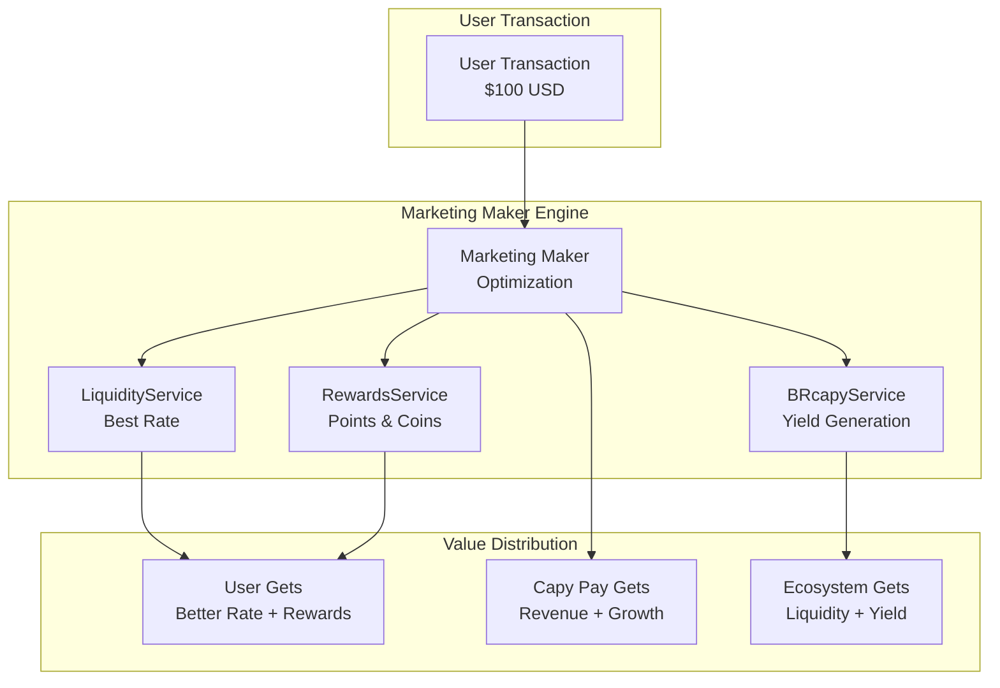

# 🪙 Tokenomics & Marketing Maker - Capy Pay

Documentação completa da arquitetura de tokenomics, incluindo o conceito inovador de "Marketing Maker" e gerenciamento de Capy Coins, BRcapy e sistema de recompensas.

## 🎯 Visão Geral: Marketing Maker Strategy

### Conceito Inovador
O Capy Pay implementa uma **estratégia de Marketing Maker** onde:
- **Cada transação gera valor** para o ecossistema
- **Usuários são recompensados** por usar a plataforma
- **Liquidez é otimizada** via provedores externos + pool própria
- **Yield é gerado automaticamente** através de pools de rendimento
- **Descontos progressivos** baseados em holdings de tokens

### Fluxo de Valor


## 🏗️ Arquitetura de Tokenomics

### Componentes Principais

```
┌─────────────────────────────────────────────────────────────┐
│                    TokenomicsService                        │
├─────────────────────────────────────────────────────────────┤
│  ┌─────────────────┐  ┌─────────────────┐  ┌─────────────── │
│  │ LiquidityService│  │ RewardsService  │  │ BRcapyService  │
│  │ Marketing Maker │  │ Points & Coins  │  │ Yield Token    │
│  │ Rate Optimization│  │ Gamification    │  │ CDI + Fees     │
│  └─────────────────┘  └─────────────────┘  └─────────────── │
├─────────────────────────────────────────────────────────────┤
│                   External Integrations                     │
├─────────────────────────────────────────────────────────────┤
│    1inch API    │   ERC-20 Tokens   │   CDI Simulation     │
└─────────────────────────────────────────────────────────────┘
```

## 💧 LiquidityService - Marketing Maker

### Estratégia de Liquidez
O LiquidityService implementa uma **estratégia híbrida**:
1. **Pool Própria Simulada** (futuro desenvolvimento)
2. **Integração 1inch** para liquidez externa
3. **Rate Optimization** para melhor preço ao usuário
4. **Revenue Generation** via spreads inteligentes

### Funcionamento do Marketing Maker

#### 1. **Obtenção de Múltiplas Cotações**
```javascript
const rates = await Promise.all([
  this.get1inchRate(fromToken, toToken, amount),     // Externa
  this.getOwnPoolRate(fromToken, toToken, amount),   // Própria (simulada)
  this.getCompetitorRates(fromToken, toToken, amount) // Benchmark
]);
```

#### 2. **Aplicação da Estratégia**
```javascript
applyMarketMakerStrategy(rates) {
  // 1. Escolher melhor taxa para o usuário
  const bestRate = rates.sort((a, b) => b.estimatedOutput - a.estimatedOutput)[0];
  
  // 2. Aplicar spread mínimo para Capy Pay
  const enhancedRate = bestRate.estimatedOutput * (1 - CAPY_SPREAD);
  
  // 3. Garantir competitividade
  return {
    userGetsMoreTokens: true,
    capyPayEarnsRevenue: true,
    marketIsMoreEfficient: true
  };
}
```

#### 3. **Pool Própria (Simulação MVP)**
```javascript
// Simulação AMM (x * y = k)
const k = fromLiquidity.multipliedBy(toLiquidity);
const newFromLiquidity = fromLiquidity.plus(amount);
const newToLiquidity = k.dividedBy(newFromLiquidity);
const outputAmount = toLiquidity.minus(newToLiquidity).toNumber();

// Aplicar spread menor que mercado
const adjustedRate = outputAmount * (1 - MARKET_MAKER_SPREAD); // 0.1% vs 0.3% mercado
```

### Métricas de Liquidez
- **Total Volume**: Rastreamento de volume USD
- **Spread Capture**: Revenue gerado via spreads
- **Success Rate**: Taxa de sucesso dos swaps
- **Slippage Average**: Slippage médio oferecido

## 🎁 RewardsService - Gamificação e Incentivos

### Sistema Dual de Recompensas

#### 1. **Capy Points (Interno)**
- **Propósito**: Gamificação e engajamento
- **Armazenamento**: Backend interno (não blockchain)
- **Conversão**: 100 Points = 1 CAPY Coin

```javascript
const pointsMultipliers = {
  'swap': 1.0,           // 1 ponto por $1 USD
  'bill_payment': 1.5,   // 1.5 pontos por $1 USD em boletos
  'referral': 10.0,      // 10 pontos por referral ativo
  'first_transaction': 50.0, // 50 pontos bonus primeira vez
  'daily_streak': 5.0,   // 5 pontos por dia consecutivo
};
```

#### 2. **Capy Coins (ERC-20)**
- **Propósito**: Utility token com valor real
- **Blockchain**: Base Network
- **Supply**: 100M tokens máximo
- **Distribuição**: Rewards automáticos + conversão de points

```javascript
const coinsDistribution = {
  'reward': 0.1,         // 0.1 CAPY por $100 USD transacionado
  'referral': 5.0,       // 5 CAPY por referral que transaciona
  'liquidity': 2.0,      // 2 CAPY por $100 USD em liquidez
  'governance': 1.0,     // 1 CAPY por participação
};
```

### Sistema de Descontos Progressivos

| CAPY Holdings | Desconto | Benefícios Adicionais |
|---------------|----------|----------------------|
| 0 CAPY | 0% | Capy Points apenas |
| 10+ CAPY | 5% | Priority support |
| 50+ CAPY | 10% | Advanced analytics |
| 100+ CAPY | 15% | Premium features |
| 500+ CAPY | 20% | VIP status |
| 1000+ CAPY | 25% | Governance voting |

### Multiplicadores por Holdings
```javascript
const holdingMultipliers = {
  capyCoins: {
    10: 1.1,   // 10% bonus output
    50: 1.15,  // 15% bonus output
    100: 1.2,  // 20% bonus output
    500: 1.25, // 25% bonus output
  },
  brcapy: {
    1000: 1.05,  // 5% bonus adicional
    5000: 1.1,   // 10% bonus adicional
  }
};
```

## 📈 BRcapyService - Yield Token

### Modelo de Rendimento Composto
A BRcapy é um **yield token** que cresce automaticamente baseado em:

#### Fontes de Rendimento
1. **CDI Brasileiro**: 10.75% anual (simulado)
2. **Taxas Internas**: 2% das taxas da plataforma
3. **Liquidity Mining**: 5% adicional

```javascript
const yieldSources = {
  cdi: {
    rate: 0.1075,      // 10.75% anual
    contribution: 0.7   // 70% do yield total
  },
  internalFees: {
    rate: 0.02,        // 2% das taxas
    contribution: 0.2   // 20% do yield total
  },
  liquidityMining: {
    rate: 0.05,        // 5% adicional
    contribution: 0.1   // 10% do yield total
  }
};
```

#### Cálculo de Valor Diário
```javascript
calculateDailyYieldRate(yieldData) {
  let totalAnnualRate = 0;
  
  // Somar todas as fontes com peso
  for (const [source, data] of Object.entries(yieldData)) {
    totalAnnualRate += data.rate * data.contribution;
  }
  
  // Converter para taxa diária com composição
  const dailyRate = Math.pow(1 + totalAnnualRate, 1/365) - 1;
  return dailyRate;
}
```

#### Auto-Investment Strategy
```javascript
// 10% de stablecoins recebidas vão automaticamente para BRcapy
if (transactionData.toToken === 'BRZ' && amount >= 50) {
  const autoInvestAmount = amount * 0.1; // 10%
  await brcapyService.mintBRcapy(userId, autoInvestAmount);
}
```

### Características do Token
- **Valor Inicial**: 1 BRcapy = 1 BRL
- **Crescimento**: Composto diário baseado em yield
- **Mint/Burn**: Usuários podem entrar/sair a qualquer momento
- **Taxa de Burn**: 0.5% para desencorajar trading especulativo

## 🔄 Integração com CoreService

### Fluxo de Recompensas Automáticas

#### 1. **Após Transação Bem-Sucedida**
```javascript
// CoreService chama TokenomicsService
const rewards = await tokenomicsService.processTransactionRewards({
  userId,
  type: 'BOLETO_PAYMENT',
  amount: 150.50,
  fromToken: 'USDC',
  toToken: 'BRL',
  success: true
});

// Resultado automático:
// - 150 Capy Points (150 USD * 1.0 multiplier)
// - 0.15 CAPY Coins (150 USD / 100 * 0.1)
// - 15 BRL auto-investidos em BRcapy (150 * 0.1)
```

#### 2. **Aplicação de Descontos**
```javascript
// Antes de cobrar taxa
const discount = await tokenomicsService.calculateTotalDiscount(userId, feeAmount);

// Combina descontos de:
// - CAPY Coins holdings
// - BRcapy position
// - Daily streak
// - Referral tier

const finalFee = discount.finalFee; // Taxa com desconto aplicado
```

#### 3. **Rate Enhancement**
```javascript
// Melhores taxas para holders
const enhancedRate = await tokenomicsService.getBestSwapRate(
  'USDC', 'BRZ', 1000, userId
);

// Usuário com 100 CAPY recebe:
// - 20% mais tokens na saída
// - 15% desconto na taxa
// - Prioridade na execução
```

## 🛠️ APIs e Endpoints

### Dashboard Completo
```javascript
GET /api/tokenomics/dashboard
// Retorna overview completo do usuário
{
  balances: { capyPoints, capyCoins, brcapy },
  performance: { portfolioValue, yields, rewards },
  benefits: { discountTier, nextTier, progress },
  projections: { dailyYield, monthlyRewards }
}
```

### Gestão de Recompensas
```javascript
POST /api/tokenomics/rewards/convert
// Converte Points em Coins
{ pointsToConvert: 1000 } // → 10 CAPY Coins

POST /api/tokenomics/referral
// Processa referral
{ referredUserId: "user123" } // → Rewards para ambos
```

### BRcapy Operations
```javascript
GET /api/tokenomics/brcapy/value
// Valor atual da BRcapy
{ currentValue: 1.0523, dailyYield: 0.0003, apy: 12.5 }

POST /api/tokenomics/brcapy/mint
// Investir em BRcapy
{ brlAmount: 1000 } // → BRcapy tokens

POST /api/tokenomics/brcapy/burn
// Resgatar BRcapy
{ brcapyAmount: 950 } // → BRL com taxa de 0.5%
```

### Liquidez e Swaps
```javascript
GET /api/tokenomics/liquidity/rates
// Taxas otimizadas com incentivos
{ fromToken: "USDC", toToken: "BRZ", amount: 1000, userId }
// → Taxa melhorada + incentives breakdown

POST /api/tokenomics/liquidity/provide
// Provisão de liquidez (futuro)
{ token: "USDC", amount: 10000 } // → LP tokens + CAPY rewards
```

## 📊 Métricas e Analytics

### KPIs Principais
- **TVL Total**: Soma de liquidez + BRcapy pool
- **Active Users**: Usuários com transações nos últimos 30 dias
- **Retention Rate**: % usuários que retornam mensalmente
- **Revenue per User**: Receita média por usuário ativo

### Dashboard Analytics
```javascript
{
  totalUsers: 1250,
  activeUsers: 890,
  totalVolumeUSD: 2500000,
  totalRewardsDistributed: 125000, // CAPY Coins
  avgAPY: 12.8, // BRcapy yield
  retentionRate: 76.3,
  revenueGrowth: 45.2 // % month over month
}
```

## 🔮 Roadmap de Tokenomics

### Fase 1: MVP (Atual)
- ✅ Capy Points sistema interno
- ✅ CAPY Coins ERC-20 simulado
- ✅ BRcapy yield token simulado
- ✅ Integração com 1inch
- ✅ Sistema de descontos

### Fase 2: Blockchain Deploy
- 🔄 Deploy CAPY token na Base
- 🔄 Deploy BRcapy token na Base
- 🔄 Smart contracts para staking
- 🔄 Governance básico

### Fase 3: DeFi Integration
- 🔮 Pool de liquidez própria on-chain
- 🔮 Yield farming automático
- 🔮 Cross-chain bridges
- 🔮 NFT rewards system

### Fase 4: DAO Governance
- 🔮 Voting system
- 🔮 Proposal mechanism
- 🔮 Treasury management
- 🔮 Community rewards

## 💡 Inovações e Diferenciais

### 1. **Marketing Maker Concept**
- **Problema**: DEXs tradicionais focam apenas em liquidez
- **Solução**: Capy Pay otimiza para experiência do usuário + incentivos
- **Resultado**: Usuários recebem melhores taxas + rewards

### 2. **Yield Token Automático**
- **Problema**: Usuários precisam manualmente stake/farm
- **Solução**: BRcapy cresce automaticamente como savings account
- **Resultado**: Yield passivo sem complexidade

### 3. **Progressive Benefits**
- **Problema**: Sistemas de loyalty binários (tem ou não tem)
- **Solução**: Benefícios crescem gradualmente com uso
- **Resultado**: Incentivo contínuo para engagement

### 4. **Multi-Source Yield**
- **Problema**: Yield farming depende de um protocolo
- **Solução**: BRcapy combina CDI + fees + mining
- **Resultado**: Yield mais estável e previsível

## 🎯 Casos de Uso

### Usuário Casual
- **Perfil**: Usa esporadicamente para boletos
- **Rewards**: Capy Points, conversão eventual para CAPY
- **Benefícios**: Desconto progressivo, gamificação

### Power User
- **Perfil**: Transações frequentes, alto volume
- **Holdings**: 100+ CAPY, 5000+ BRcapy
- **Benefícios**: 15% desconto, 20% bonus output, yield passivo

### Liquidity Provider (Futuro)
- **Perfil**: Provê liquidez para a pool
- **Rewards**: CAPY tokens + fees da pool
- **Benefícios**: APR competitivo, governance voting

### Referrer
- **Perfil**: Traz novos usuários
- **Rewards**: 5 CAPY por referral ativo
- **Benefícios**: Revenue sharing, tier especial

---

## 🎪 **O Marketing Maker em Ação**

### Exemplo Prático: Swap de $1000 USDC → BRZ

#### **Usuário Comum (0 CAPY)**
```
Input: 1000 USDC
Market Rate: 5.20 BRZ per USDC
Capy Pay Rate: 5.195 BRZ per USDC (0.1% spread)
Output: 5,195 BRZ
Fee: 0.3% = 15.58 BRL
Rewards: 10 Capy Points
```

#### **Power User (100 CAPY + 2000 BRcapy)**
```
Input: 1000 USDC  
Base Rate: 5.195 BRZ per USDC
Multiplier: 1.2x (20% bonus)
Enhanced Output: 6,234 BRZ (20% more!)
Fee: 0.3% - 15% discount = 13.24 BRL
Auto-Investment: 623 BRL → BRcapy (10%)
Rewards: 10 Capy Points + 1 CAPY Coin
```

#### **Resultado para o Ecossistema**
- **Usuário**: Melhor taxa + rewards + yield passivo
- **Capy Pay**: Revenue + user retention + TVL growth  
- **Mercado**: Mais liquidez + price discovery

### **Por que é "Marketing Maker"?**
1. **Marketing**: Cada transação é um incentivo para voltar
2. **Maker**: Criamos liquidez e valor para o ecossistema
3. **Win-Win-Win**: Usuário, Capy Pay e mercado se beneficiam

---

## 🚀 **Conclusão**

A arquitetura de tokenomics do Capy Pay implementa um **modelo inovador** que transforma cada transação em uma oportunidade de **crescimento mútuo**:

- **Usuários** recebem melhores taxas, rewards e yield passivo
- **Capy Pay** gera revenue sustentável e engagement
- **Ecossistema** cresce com mais liquidez e participação

O conceito de **Marketing Maker** redefine como plataformas DeFi podem criar valor, focando na **experiência do usuário** em vez de apenas eficiência de capital.

**🎯 O resultado é um flywheel de crescimento onde sucesso do usuário = sucesso da plataforma!** 